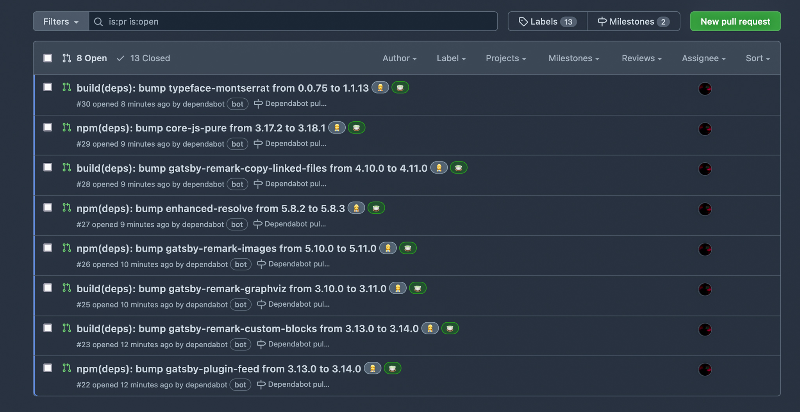

## モチベーション

* [Dependabot](https://dependabot.com/)はGitHubから簡単に設定できるが、オプションまで設定したことがなかったのでやってみたかった
* 定型的な作業はできるだけ自動化したい
* 今後使いまわせるようなテンプレートを作成したい

## TL;DR

全てのオプションを調べてみて出来上がったテンプレートがこちら。
当ブログで実際に`.github/dependabot.yml`として運用している。

```yaml:title=dependabot.yml
version: 2
updates:
  - package-ecosystem: "npm"
    directory: "/"
    schedule:
      timezone: "Asia/Tokyo"
      interval: "daily"
      time: "03:00"
    target-branch: "dev"
    allow:
      - dependency-type: "all"
    assignees:
      - "ktnkk"
    commit-message:
      prefix: "npm"
      include: "scope"
    labels:
      - ":tea:"
      - ":construction_worker_woman:"
    milestone: 3
    open-pull-requests-limit: 10
    pull-request-branch-name:
      separator: /
    rebase-strategy: "auto"
  - package-ecosystem: "docker"
    directory: "/"
    schedule:
      timezone: "Asia/Tokyo"
      interval: "daily"
      time: "03:00"
    target-branch: "dev"
    allow:
      - dependency-type: "all"
    assignees:
      - "ktnkk"
    commit-message:
      prefix: "docker"
      include: "scope"
    labels:
      - ":whale:"
      - ":construction_worker_woman:"
    milestone: 3
    open-pull-requests-limit: 10
    pull-request-branch-name:
      separator: /
    rebase-strategy: "auto"
```

Yarn (npm) とDockerfileの2つの依存関係を調べる設定になっているため冗長な書き方になっている。
アンカーとエイリアスを使ってみたがDependabotでは使えないみたい。

## 各オプションについて

今回使用したオプションについて箇条書きで書き留めていく。
デフォルトの設定をそのまま書いているのもあるが、後から変更の可能性があるものを選んでいる。

### package-ecosystem

```yaml:title=dependabot.yml
updates:
  - package-ecosystem: "npm"
```

* **必須**
* 新しいバージョンを監視するパッケージマネージャを設定
* [対象の言語](https://dependabot.com/#languages)

### directory

```yaml:title=dependabot.yml
updates:
  - package-ecosystem: "npm"
    directory: "/"
```

* **必須**
* 各パッケージマネージャーのパッケージマニフェストの場所を定義
* 通常であればプロジェクトルートなると思う（`/`）

### schedule

```yaml:title=dependabot.yml
updates:
  - package-ecosystem: "npm"
    directory: "/"
    schedule:
      timezone: "Asia/Tokyo"
      interval: "daily"
      time: "03:00"
```

* **必須**
* 新しいバージョンをチェックする頻度を定義
* デフォルトでは`interval: "daily"`だけだが、UTC（日本時間より9時間遅い）ので注意
* 明示的に`timezone: "Asia/Tokyo"`でタイムゾーンを指定して`time: "03:00"`のようにアクセスが少ない時間を設定するのが良いと思う

### target-branch

```yaml:title=dependabot.yml
updates:
  - package-ecosystem: "npm"
    <omitted>
    target-branch: "dev"
```

* デフォルトではデフォルトのブランチ（`main`のような）にプルリクエストが作成される
* 当ブログではNetlifyを使っているため毎回ビルドされると制限時間を圧迫してしまう
* そのため開発用のブランチ（`dev`）に対してプルリクエストが作成されるようにした

### allow

```yaml:title=dependabot.yml
updates:
  - package-ecosystem: "npm"
    <omitted>
    allow:
      - dependency-type: "all"
```

* バージョンの更新で維持する依存関係をカスタマイズできる
* デフォルトではすべての依存関係がチェックされる
* `production`や`development`を設定することでそれぞれ本番環境、開発環境だけを最新の状態に保つことができる

### assignees

```yaml:title=dependabot.yml
updates:
  - package-ecosystem: "npm"
    <omitted>
    assignees:
      - "ktnkk"
```

* Dependabotによって作成されたプルリクエストの`Assignees`を指名できる
* GitHubのユーザ名を指定

### commit-message

```yaml:title=dependabot.yml
updates:
  - package-ecosystem: "npm"
    <omitted>
    commit-message:
      prefix: "npm"
      include: "scope"
```

* デフォルトではDependabotはコミットメッセージの設定を検出し、同様のパターンを使用しようする（すごい！）
* 明示的に指定することもできる
  * `prefix` -> プレフィックス（featやfixみたいな）
  * `include: "scope"` -> プレフィックスの後にコミットで更新された依存関係のリストが続く

### labels

```yaml:title=dependabot.yml
updates:
  - package-ecosystem: "npm"
    <omitted>
    labels:
      - ":tea:"
      - ":construction_worker_woman:"
```

* プルリクエストの`Labels`を指定できる
* **先にラベルを作っておかないといけないので注意**
* `labels: [ ]`を使うと勝手にラベルが作られない
* 順番は言語（javascript） -> 依存関係（dependencies）

### milestone

```yaml:title=dependabot.yml
updates:
  - package-ecosystem: "npm"
    <omitted>
    milestone: 3
```

* マイルストーンのIDを指名することで関連付けることができる
* どれくらいDependabotを使ったのかを記録するために使用した

### open-pull-requests-limit

```yaml:title=dependabot.yml
updates:
  - package-ecosystem: "npm"
    <omitted>
    open-pull-requests-limit: 10
```

* デフォルトでは、バージョン更新のために**最大5つ**のプルリクエストを開く
* もっとたくさんプルリクエストを送って欲しいなら上限を上げる
* 0にするとバージョン更新を一時的に無効にできる

### pull-request-branch-name

```yaml:title=dependabot.yml
updates:
  - package-ecosystem: "npm"
    <omitted>
    pull-request-branch-name:
      separator: /
```

* デフォルトでは`/`でパッケージマネージャーと依存関係が区切られている
  * 例: `dependabot/npm_and_yarn/dev/csstype-3.0.9`
* この区切り文字を変えられる（`"-"`, `_`）

### rebase-strategy

```yaml:title=dependabot.yml
updates:
  - package-ecosystem: "npm"
    <omitted>
    rebase-strategy: "auto"
```

* デフォルトでは、プルリクエストへの変更を検出すると開いているプルリクエストを**自動的にリベース**する
* これをしてほしくない場合は`rebase-strategy: "disabled"`と指定する

## 実際の運用



このような感じでプルリクエストが作成される。
テンプレートの内容を書き換えれば大抵のプロジェクトに対応できる。

## さいごに

* 他にもオプションはあるがプライベートレジストリの構成に関するものだったりとあまり必要なさそうだったので省いた
  * 実際に使う機会があれば追記する
* Yarn関連のアップデート多すぎ……
  * GitHub Actionsで自動テストして問題なければ自動マージしてくれるようにしたい
