徐々にデスク周りの環境を整えてきてようやく自分の理想とする形になってきた。そこで記事として記録に残しておくことにした。
これまで欲しかったパーツが無かったりして中途半端な環境でプログラムを書いたりしてきたが、環境を改善したことで最近の作業効率は爆上がりしている。

## 全体像

このスタイルの大きなポイントはスタンディングデスクを取り入れたことだ。
まずデスク構成を考えるうえでテーブルトップのサイズ感が大事である。
結論から言うともう少し幅をとっても良かったかなという感じもするがおおむね満足している。

## テーブルトップ｜マルトクショップ

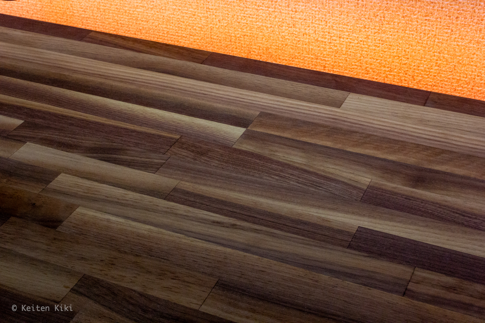

このテーブルトップは板から切り出してもらい、自分で加工した完全オーダーメイドである。
これから長い間使うであろうテーブルだからやっぱり経年変化を楽しみたい。
既製品だとコーティングされてあったり、木材をペタペタ貼り付けたようなものがほとんど。あったとしてもちょうど良いサイズ感のものがなく、板をオーダーするのは必然であった。
結果的に[マルトクショップ](https://shop.woodworks-marutoku.com/)というデスク自作ガチ勢にとってはお馴染みの店でオーダーすることにした。

- 商品名：ウォールナット集積材（積層材）フリーカット
- 木材の形：四角形
- 寸法：厚さ 30mm、幅（奥行）600mm、長さ 1800mm
- 重量：約 19.1kg
- 反り止め：無し
- ジャストカットの有無：有り
- 用途：三方向使用
- 金額：37,820 円（内消費税 3,438 円）

世界三大銘木であるウォールナットを選択。
最初は無垢材にしようかと思っていたけど、金額をシミュレートしてその夢は打ち砕かれた。
集積材と無垢材には天と地ほどの金額差がある。
消去法で集積材を選択したがそこでも節ありか節なしかの選択が発生した。そこでは奮発して節なしを選んだ。

そこからヤスリをかけてオイルを塗っていくのだが、なかなか大変だった。
大きい庭があれば良いけど、室内でするときはヤスリで生まれた粉の処理に細心の注意を払う必要がある。

## 昇降デスク｜ FlexiSpot E7

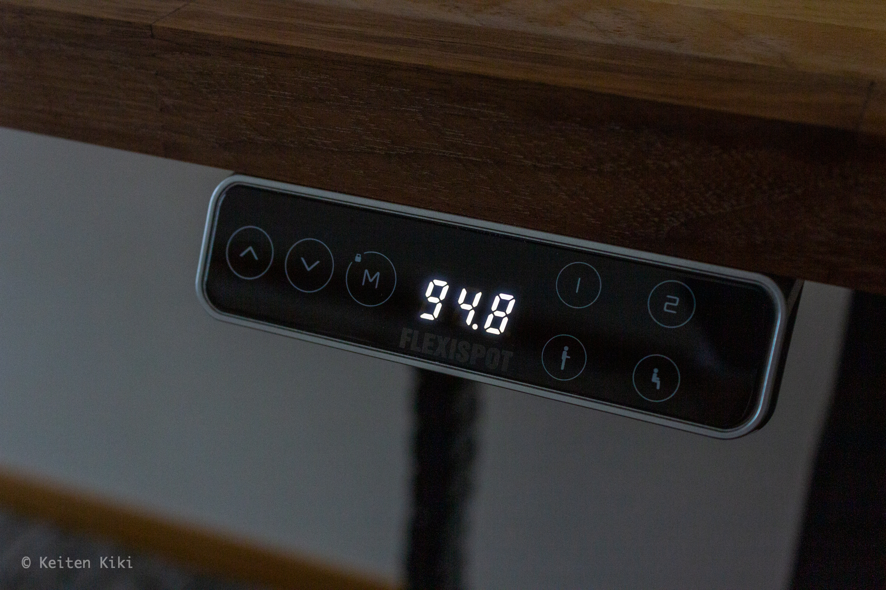

スタンディングデスクの脚だけ購入した。
テーブルトップは自作したからドッキングするだけで完成する。
が、そんな簡単にいかない現実が待っていた。

テーブルトップが約 19kg、脚が約 35kg、合計で 54kg ある。
バーベルで 50kg は大したことないけど、この形状だととんでもなく重く感じる。
ひっくり返して作業していたので戻すのにとても神経を使った。

肝心の使い心地は最高。
これは全ての人にオススメできる。
まず、立たなくても着座時の机位置を完璧に合わせられることがデカい。
スタンディングデスクの心は座ったときの状態にこそある。

また、耐荷重も 125kg だから普通に使う分には載せるものを気にしなくても良い点も素晴らしい。
私は座ったときと立ったときの高さを記憶させているからワンタッチでアップダウンを机に任せている。

## ワークチェア｜ HermanMiller Sayl Chair

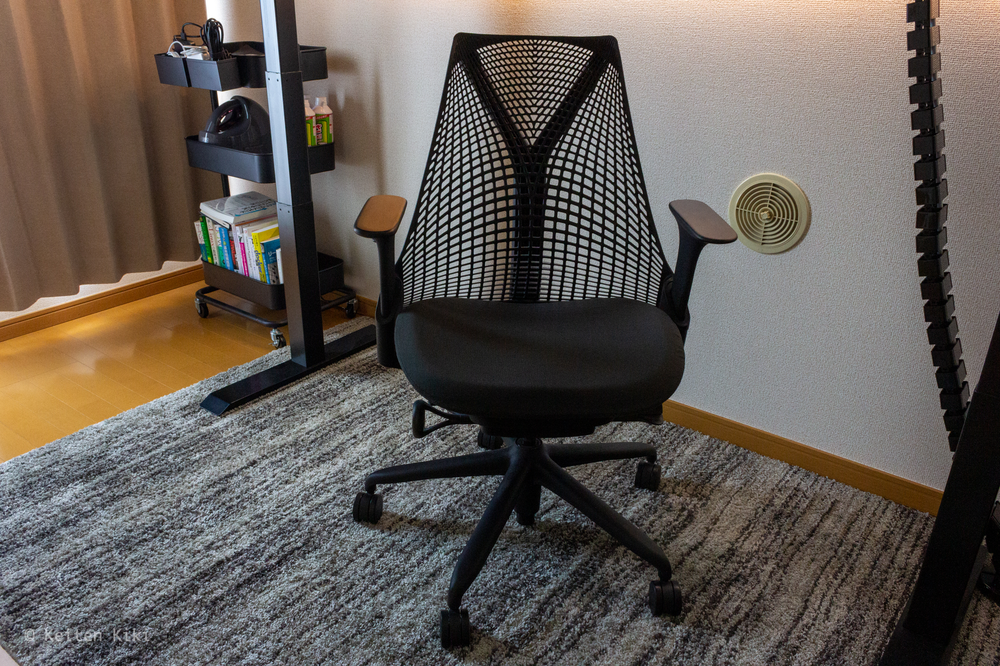

椅子は HermanMiller のセイルチェアを選んだ。
本当はアーロンチェアが欲しかったけど予算オーバーしていたので諦めた。
そこでこの椅子に白羽の矢が立ったという訳である。

コンセプト的にもアーロンチェアの廉価版見たいな感じで思想的にもマッチしたので購入を決断した。
届いてみて驚いたけど普通にカッコいい。
前傾チルトも付いてるし（あんまり使わないけど）、腰にピッタリとフィットするしで悪くない買い物だった。

## モニタ｜ Dell U2720QM

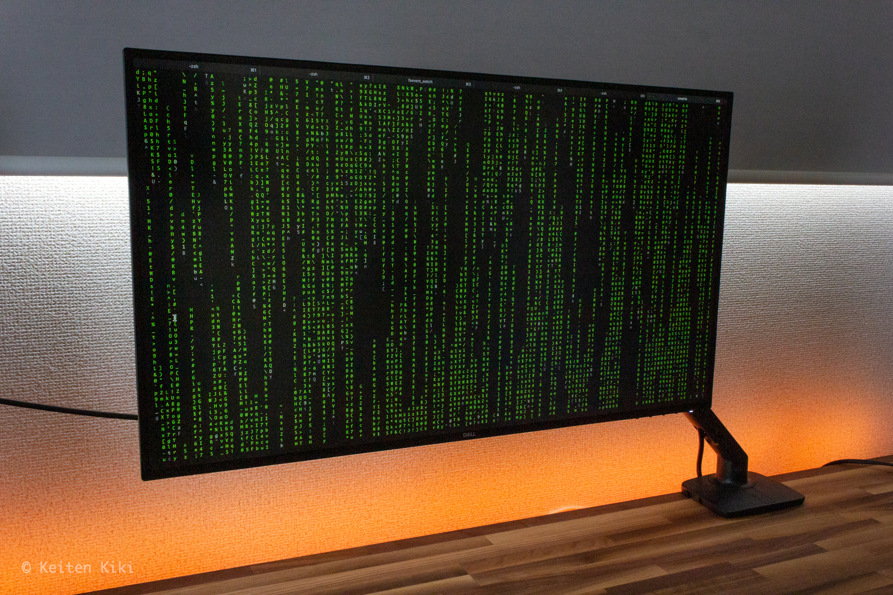

モニタは Dell の 4K モニター、大きさは 27 インチをチョイス。
31.5 インチにするか迷ったが結果的に見て正解だった。

なぜなら、まず価格の乖離がデカすぎて 31.5 インチはコスパが悪いからだ。
当時の価格で 31.5 インチは約 10 万円、27 インチは約 6 万円であった。
たった 4.5 インチの違いで 4 万円も差が出るのは謎でしょうがない。
しかも 31.5 インチは常に売り切れだったし。

もう 1 つの理由がテーブルトップの奥行きとの兼ね合いだ。
多分だが、奥行き 60cm であるなら 27 インチがちょうど良い（アームで少し前に出てる）。
職場で 31.5 インチの同製品を使っているがそれだとモニタとの距離に対して視野が広すぎる。
これも個人的な好みだが私は顔を一切動かさずに作業するのでこれぐらいが好きかな。
もちろん、奥行きの広いテーブルであれば大きいサイズにすべきだ。

## モニタアーム｜ Ergotron MXV

Dell のモニタに付属していた土台も調節が楽で使いやすいものではあった。
だが、このアームの素晴らしさはモニタと対面したときにしか分からない。
正面に立つとモニタが浮いて見える。
まるでマジックだ。そして、後述するがライトとの相性も抜群でプログラミング時のテンション爆あがり間違いなし。

## キーボード｜ HHKB Professional HYBRID Type-S

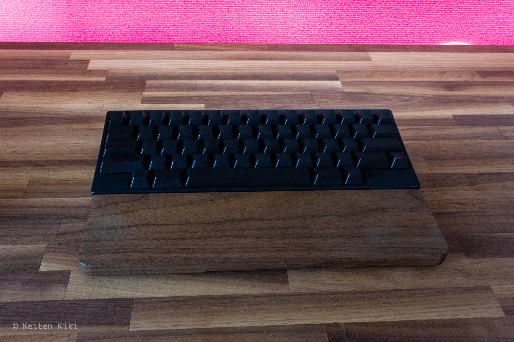

これは結構有名なキーボードである。
没個性的になりつつあるアイテム。

最初は違和感がすごくて手に負えないと思っていたけど、今じゃコイツなしではやる気が起きないほどの相棒になった。
Fn キーの使い方とか癖あるが慣れると本当に効率的にタイピングできる。
ちなみに手前にあるパームレストは必需品。これがないと腱鞘炎になりそう。

## マウス｜ Logicool MX Master 3

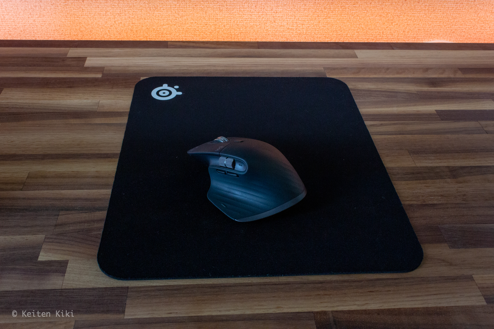

少し変わった形のマウスだが、人間工学に基づいた形らしい。
確かに慣れると手のひらにフィットして使いやすい。

そして、このマウスのもっとも良いところは横スクロールがしやすいことだ。
意外に IDE や Ps、Ai で横スクロールする機会は多いから重宝する。
shift キーを押しながらでもできるソフトはあるけど絶対じゃないから基本的にマウスを使うことが多い。
あとは幾つかボタンが付いてるのも地味に便利。
専用ソフトで変えられるみたいだけどデフォルトが十分活躍しているから当分変更の手続きは必要ないかな。

下に敷いてあるマットもオススメ。
Amazon のレビューが 28,000 越えで匿名の人々に支持されているから買って後悔は発生しないだろう。

## スピーカー｜ Echo Studio

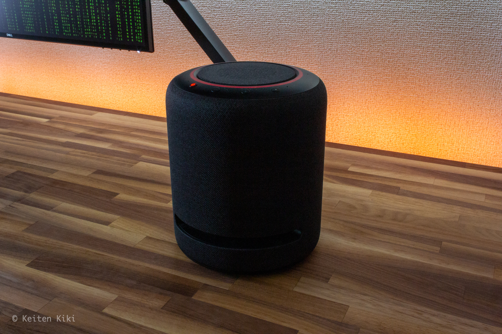

当初はスピーカーを買うつもりなんてなかった。
しかし、後述する Philip Hue がハブを必要とするという誤算。
せっかくハブを買うのであれば音楽も聴ければ一石二鳥だろうということでアレクサの中でも音質にこだわったと自称するこの子をセレクトした。

結論から言って買ってよかった。
なくても十分生活はできるのだが、怖い話とかしてくれるし案外頭いい。
人間が言うであろうことをあらかじめインプットされているのか、それとも学習していくのかは分からないがふざけたこと言ってもちゃんと返してくれるのは引きこもり生活の精神安定剤としては優秀だ。
ただ、ジャズ流してと言うとブライアン・カルバートソンばかり流すセンスは分からんが。

## ライト｜ Philips Hue ライトリボンプラス

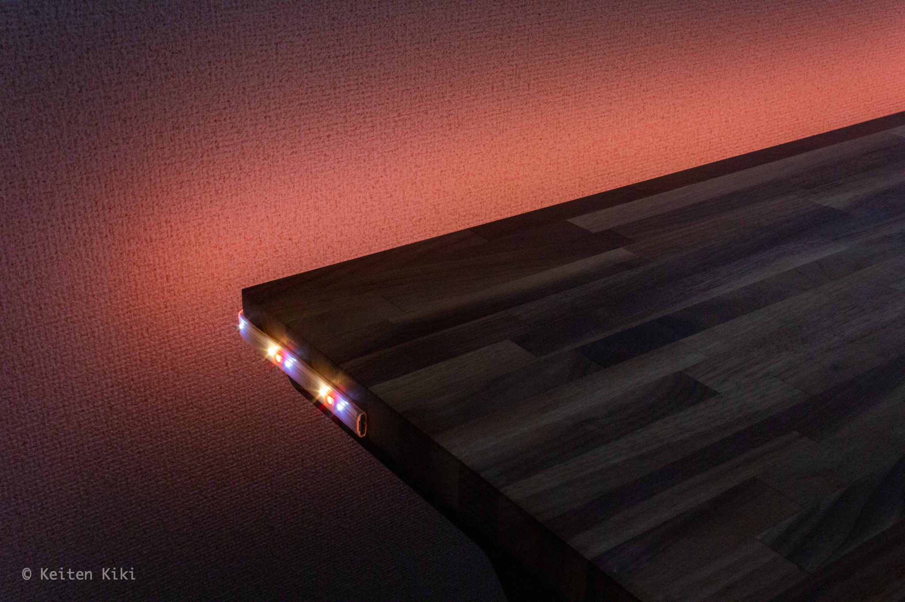

アレクサを買うきっかけにもなったのがこのライトリボンだ。
想像の 3 倍ほど高い値段ではあるが Philips Hue のライトは凄い。
何がすごいって色から明度まで自由自在に変更できるし、アレクサに指示すれば忠実に実行される。

ただ、色々な色があるけど結局「電球色・明るさ 60%」しか使ってない。
やっぱり赤とか青は少し気が散るかな。
でも、こういった撮影で雰囲気出るから重宝はしている。
Philip Hue のハブだともっとバラエティに富んだことができるらしいが、それに 6,000 円払うのも微妙なので検討中。

## ノート PC スタンド｜ BoYata

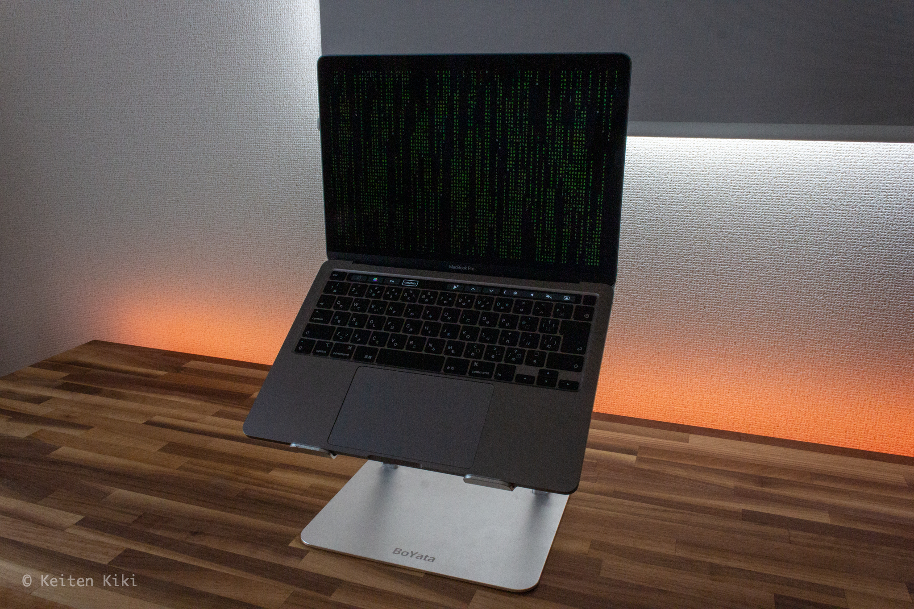

まだモニタを持ってないときに購入したもの。
これがあると首が楽で助かった。
今では必要性はそんなに感じないが放熱性に優れているのでただの文鎮みたいな存在かな。
そのうち自作 PC を作ればコイツもお役御免だ。
モニタがないのなら必需品、モニタがあれば置物。

## ブックスタンド｜ wishacc

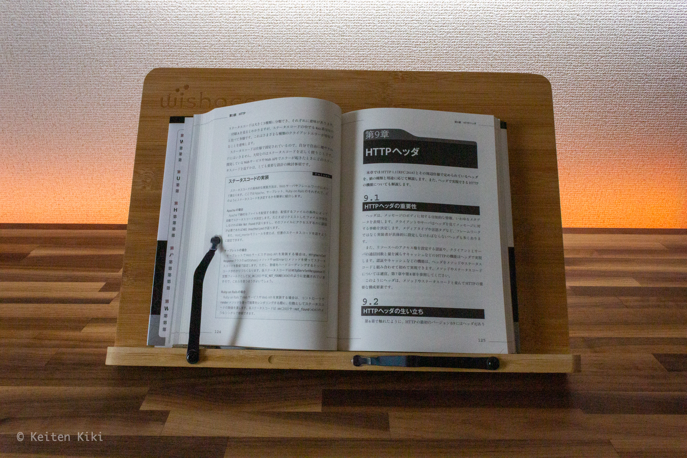

これは値段の割りにかなり便利。
小説を読むのであれば必要ないけど、技術書を見ながらコード書いたりメモを取ったりするときに大助かりする。

## ワイヤレス充電器｜ Anker PowerWave 10 Stand

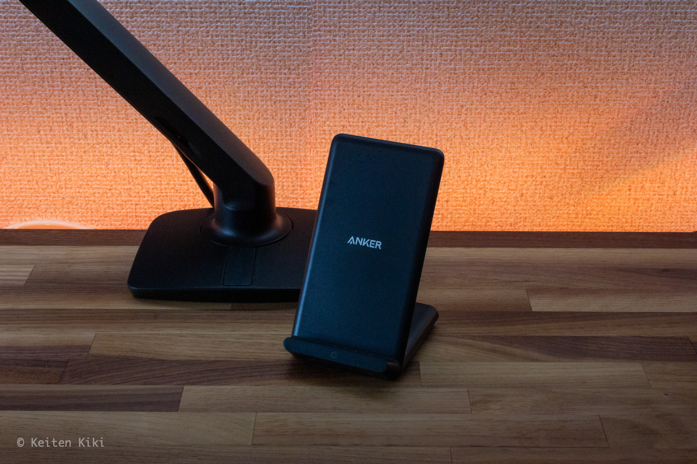

スマホ充電常時 100%の立役者。
これを買うまでは充電切れになるケースが続出していたがこれを買ってからはただ置くだけなので常に充電されている。
コードの抜き差しは想像以上に面倒でコストが掛かるから値段以上の価値はある。

## ケーブルダクト｜ FlexiSpot

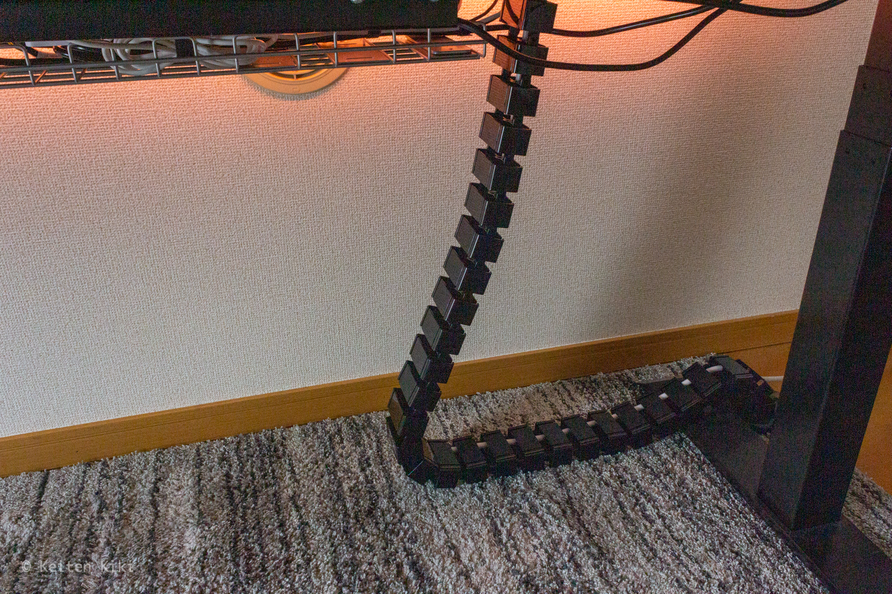

完全に見て呉れで買ったただのオシャレアイテム。
中にコード 1 本しか通っていないという贅沢な使い方をしている。
でも昇降するたびに柔軟に動く様はまるで黒蛇のよう。個人的満足度は星 5。

## ケーブルマネジメント

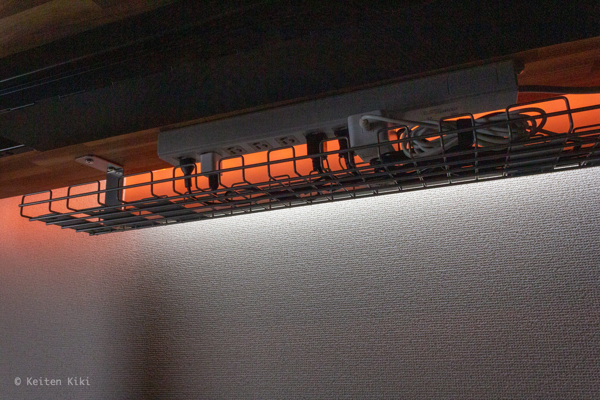

配線の見え方はかなりこだわったポイントである。
机が低い位置にある状態では全くコードが見えないし、存在を感じさせない。
意外と取付が大変だったので下記のケーブル配線トレーを導入するのであれば十分に気を付けてほしい。
ネジかと思ったらまさかのボルト取付で驚いた。
電動ドライバーは必須で下穴も開ける必要がある。

少しミスったかなって思っていることはトレーの真上にタップを付けたことだ。
ミニマルで見かけは良いのだがコンセントを差し込むのが大変だった。

## ラグ｜スミノエ リュストル

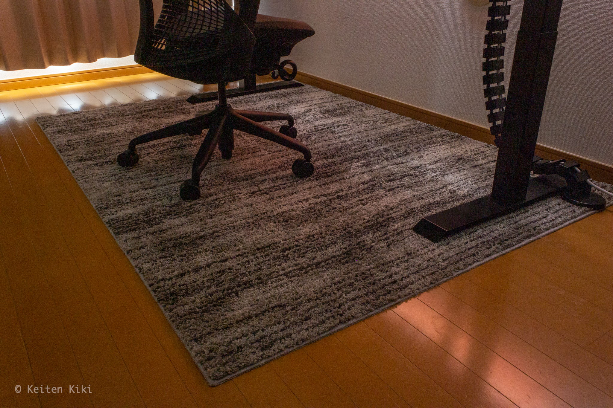

天井が高い部屋に存在する作業スペースなので当然埃が舞う。
それを吸着するためのクッションとしてラグを買った。
しかし、その目的が最下層に転落してしまうほどその他のメリットが大きいのでラグはオススメ。

まず、このとんでもなく重い机を扱うということは床に傷をつけてしまうということと同義である。
机に何も載せない人はいないだろうから最初は良くても年々地盤沈下が起きるのは必然だ（多分現時点で 70kg ある。予定では 90kg）。
特に私の場合は組み立て時に何度かこの脚を床に落としたがラグが良いクッションになってくれたので感謝している。

そして、何より裸足で乗ったときの感覚が素晴らしい。
やはりプログラムを書く際は裸足で書いたほうが開放感もあり捗るものだ。
これが冷たいフローリングだったらそうはいかないだろう。
ラグは値段がピンキリなので選ぶのに苦労したが、日本メーカーのスミノエはコスパが良くてオススメだ。

## ロールスクリーン｜ニトリ

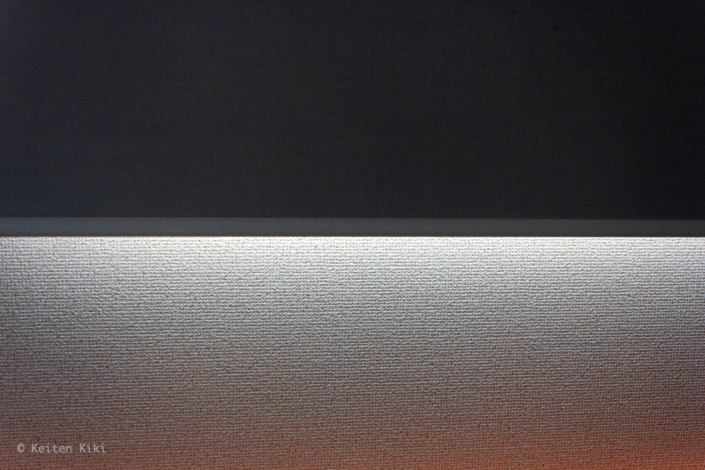

正面が南向きという日当たりの良さは眩しいのが苦手な私を苦しめた。しかし、モニタの照度と後ろの照度は同じくらいが目が疲れにくいらしい。
初めはカーテンだったけど何か違うなと感じたから即返品し、ニトリでロールスクリーンをオーダーした。

これが大正解で、スクリーンの下から溢れる光がまるで間接照明のようで非常に心地よい。
格段に目も疲れにくくなり一日 16 時間モニタと対面しても全く問題なくなった。

## スチールワゴン｜ニトリ

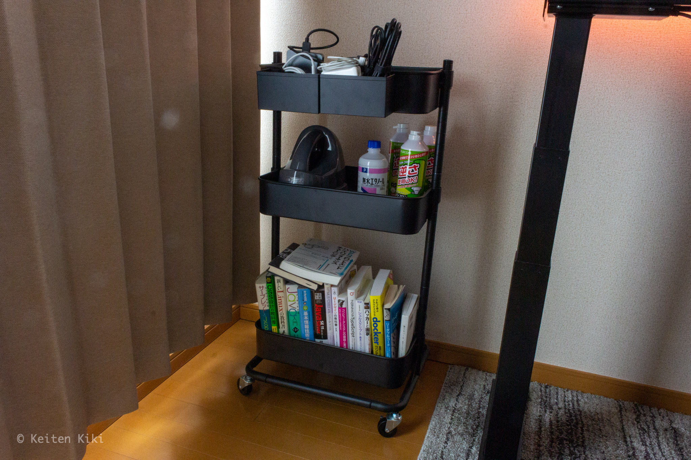

タイヤ付きはナイスなポイント。
オンライン試験の時は本などを移動させる必要があるので助かっている。
そして、ケースの下が網目になってるので埃が溜まりにくい。
意外に容量あるし 1 つあれば重宝する（3 つ持ってる）。

## キャンドル｜ P.F.Candle Co

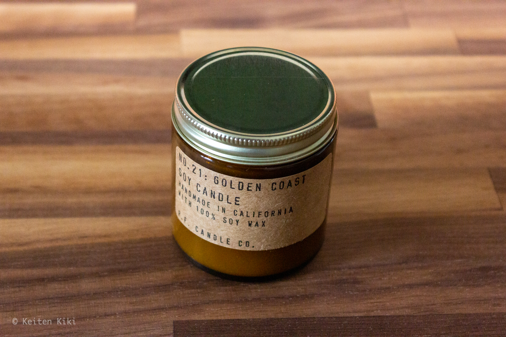

夜中に作業しているとき、気分転換として火を付ける。
香りは全然強くない、むしろほとんど香らないのだが目の前に火が存在するという事実が心を落ち着かせる。

香らないのはこの蝋が大豆で作られているからだ。
その代わりにパラフィン特有の人工的な臭さがないのは良い。
ただ、本音を言うともう少し香ってほしい。同ブランドのリードディフューザー買おうか検討中。

## あとがき

人間の欲望には際限がない。ということで、更により良い環境を作っていきたい。

- モニタとアームをもう一対購入し、デュアルディスプレイにする
- 高性能な自作 PC の作成（グラボ以外は購入済み）
- アーロンチェアを買う
- フットスイッチの導入
- 核ミサイルに耐えられる金庫の用意
- EMP 攻撃対策としてファラデーケージの導入
