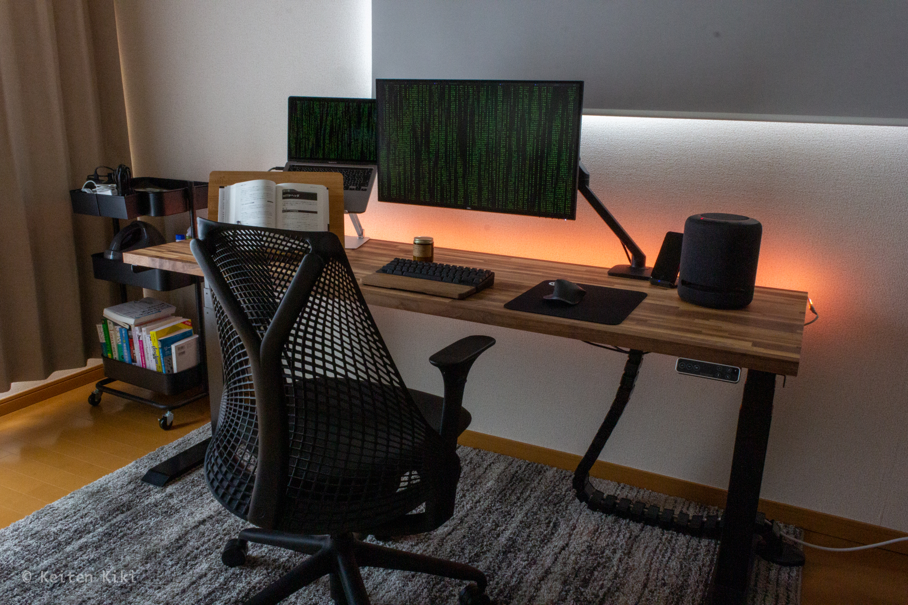
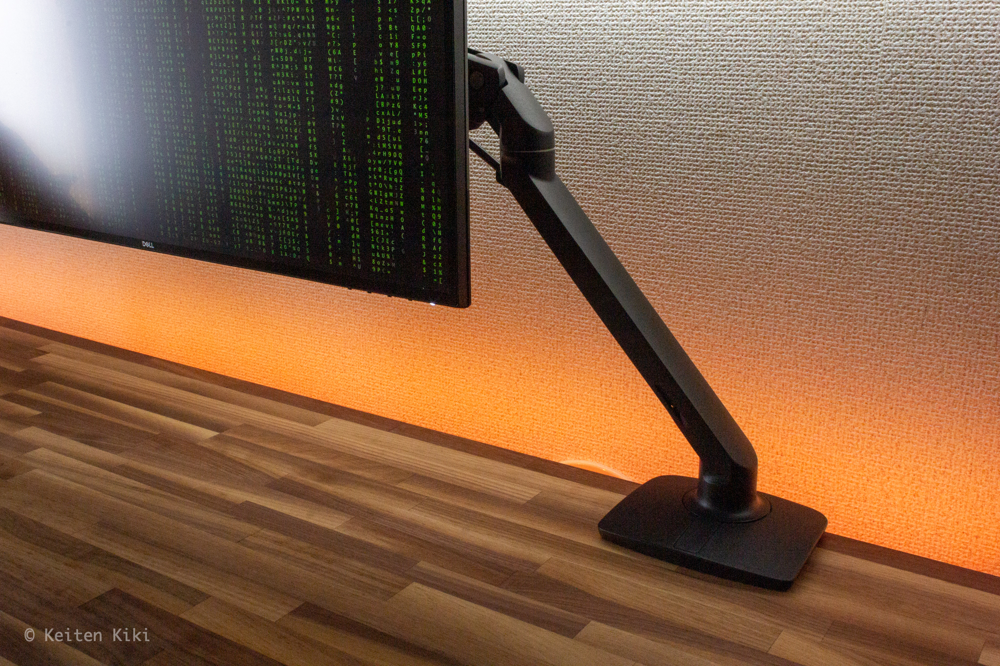

徐々にデスク周りの環境を整えてきてようやく自分の理想とする形になってきたので記事にして記録に残しておくことにした。
これまで欲しかったパーツが無かったりして中途半端な環境でプログラムを書いたりしてきたが、環境を改善したことで最近の作業効率は爆上がりしている。

## 全体像

このスタイルの大きなポイントはスタンディングデスクを取り入れたことだ。
まずデスク構成を考える上でテーブルトップのサイズ感が大事である。
結論から言うともう少し幅をとっても良かったかなという感じもするが概ね満足している。

## テーブルトップ｜マルトクショップ

このテーブルトップは板から切り出してもらい、自分で加工した完全オーダーメイドである。
これから長い間使うであろうテーブルだからやっぱり経年変化を楽しみたい。
既製品だとコーティングがされてあったり、木材をペタペタ貼り付けたようなものがほとんど。あったとしても丁度良いサイズ感のものがなく、板をオーダーするのは必然であった。
結果的に[マルトクショップ](https://shop.woodworks-marutoku.com/)というデスク自作ガチ勢にとってはお馴染みの店でオーダーすることにした。

[[i | オーダー内容]]
| * 商品名：ウォールナット集積材（積層材）フリーカット
| * 木材の形：四角形
| * 寸法：厚さ30mm、幅（奥行）600mm、長さ1800mm
| * 重量：約19.1kg
| * 反り止め：無し
| * ジャストカットの有無：有り
| * 用途：三方向使用
| * 金額：37,820円（内消費税3,438円）

世界三大銘木であるウォールナットを選んだ。
最初は無垢材にしようかと思っていたが、金額をシミュレートしてその夢は打ち砕かれた。
集積材と無垢材には天と地ほどの金額差がある。
消去法で集積材を選択したがそこでも節ありか節なしかの選択が発生したが、そこでは奮発して節なしを選んだ。

そこからヤスリをかけてオイルを塗っていくのだが、なかなか大変だった。
大きい庭があれば良いけど、室内でするときはヤスリで生まれた粉の処理に細心の注意を払う必要がある。

## 昇降デスク｜FlexiSpot E7

スタンディングデスクの脚だけ購入した。
テーブルトップは自作したからドッキングするだけで完成する。
が、そんな簡単にいかない現実が待っていた。

テーブルトップが約19kg、脚が約35kg、合計で54kgある。
バーベルで50kgは大したことはないけれど、この形状だととんでもなく重く感じる。
ひっくり返して作業していたので戻すのにとても神経を使った。

肝心の使い心地は最高。
これは全ての人にオススメできる。
まず、立たなくても着座時の机位置を完璧に合わせられることがデカい。
スタンディングデスクの心は座った時の状態にこそある。

また、耐荷重も125kgだから普通に使う分には載せるものを気にしなくても良い点も素晴らしい。
私は座った時と立った時の高さを記憶させているからワンタッチでアップダウンを机に任せている。

## ワークチェア｜HermanMiller Sayl Chair

椅子はHermanMillerのセイルチェアを選んだ。
本当はアーロンチェアが欲しかったけど予算オーバーしていたので諦めた。
そこで白羽の矢が立ったのがこの椅子。

コンセプト的にもアーロンチェアの廉価版見たいな感じで思想的にもマッチしたので購入を決断した。
届いてみて驚いたけど普通にカッコいい。
前傾チルトも付いてるし（あんまり使わないけど）、腰にピッタリとフィットするしで悪くない買い物だった。

## モニタ｜Dell U2720QM

モニタはDellの4Kモニター、大きさは27インチをチョイス。
31.5インチにするか迷ったが結果的に見て正解だったと思う。

なぜなら、まず価格の乖離がデカすぎて31.5インチはコスパが悪いからだ。
当時は31.5インチは約10万円、27インチは約6万円であった。
たった4.5インチの違いで4万円も差が出るのが謎でしょうがない。
しかも31.5インチは常に売り切れだったし。

もう1つの理由がテーブルトップの奥行きとの兼ね合いだ。
多分だが、奥行き60cmであるなら27インチが丁度良いと思う（アームで少し前に出てる）。
職場で31.5インチの同製品を使っているがそれだとモニタとの距離に対して視野が広すぎる。
これも個人的な好みだが私は顔を一切動かさずに作業するのでこれぐらいが好きかな。
もちろん、奥行きの広いテーブルであれば大きいサイズにすべきだ。

## モニタアーム｜Ergotron MXV

Dellのモニタに付属していた土台も調節が楽で使いやすいものではあった。
だが、このアームの素晴らしさはモニタと対面した時にしか分からないと思う。
正面に立つとモニタが浮いて見える。
まるでマジックだ。そして、後述するがライトとの相性も抜群でプログラミング時のテンション爆あがり間違いなし。

## キーボード｜HHKB Professional HYBRID Type-S

これは結構有名なキーボードだと思う。
初めて買ったキーボードがこれ。エンジニアとして働くなら手の代わりになるキーボードにお金を費やすのは当然という思考で評判の高かったコイツを迷わずポッチ。

しかし、実際に働いてみるとみんなそこまでキーボードにこだわりないみたいだ。
とはいえ、最初は違和感ハンパなくて手に負えないと思っていたけど、今じゃコイツなしではやる気が起きないほどの相棒になった。
Fnキーの使い方とか癖あるが慣れると本当に効率的にタイピングできる。
ちなみに手前にあるパームレストは必需品。これがないと腱鞘炎になりそう。

## マウス｜Logicool MX Master 3

少し変わった形のマウスだが、人間工学に基づいた形らしい。
確かに慣れると手のひらにフィットして使いやすい。

そして、このマウスの最も良いところは横スクロールがしやすいことだと思う。
意外にIDEやPs、Aiで横スクロールする機会は多いから重宝する。
shiftキーを押しながらでもできるソフトはあるけど絶対じゃないから基本的にマウスを使うことが多い。
あとは幾つかボタンが付いてるのも地味に便利。
専用ソフトで変えられるみたいだけどデフォルトが十分活躍しているから当分変更の手続きは必要ないかな。

下に敷いてあるマットもオススメ。
Amazonのレビューが28,000越えで匿名の人々に支持されているから買って後悔は発生しないだろう。

## スピーカー｜Echo Studio

当初はスピーカーを買うつもりなんてなかった。
しかし、後述するPhilip Hueがハブを必要とするという誤算。
せっかくハブを買うのであれば音楽も聴ければ一石二鳥だろうということでアレクサの中でも音質にこだわったと自称するこの子をセレクトした。

結論から言って買ってよかった。
なくても十分生活はできるのだが、怖い話とかしてくれるし案外頭いい。
人間が言うであろうことをあらかじめインプットされているのか、それとも学習していくのかは分からないがふざけたこと言ってもちゃんと返してくれるのは引きこもり生活の精神安定剤としては優秀だ。
ただ、ジャズ流してと言うとブライアン・カルバートソンばかり流すセンスは分からんが。

## ライト｜Philips Hue ライトリボンプラス

アレクサを買うきっかけにもなったのがこのライトリボンだ。
想像の3倍ほど高い値段ではあるがPhilips Hueのライトは凄い。
何がすごいって色から明度まで自由自在に変更できるし、アレクサに指示すれば忠実に実行される。

ただ、色々な色があるけど結局「電球色・明るさ60%」しか使ってない。
やっぱり赤とか青は少し気が散るかな。
でも、こういった撮影で雰囲気出るから重宝はしている。
Philip Hueのハブだともっとバラエティに富んだことができるらしいが、それに6,000円払うのも微妙なので検討中。

## ノートPCスタンド｜BoYata

まだモニタを持ってないときに購入したもの。
これがあると首が楽で助かった。
今では必要性はそんなに感じないが放熱性に優れているのでただの文鎮みたいな存在かな。
そのうち自作PCを作ればコイツもお役御免だ。
モニタがないのなら必需品、モニタがあれば置物。

## ブックスタンド｜wishacc

これは値段の割りにかなり便利。
小説を読むのであれば必要ないけど、技術書を見ながらコード書いたりメモを取ったりするときに大助かりする。

## ワイヤレス充電器｜Anker PowerWave 10 Stand

スマホ充電常時100%の立役者。
これを買うまでは充電切れになるケースが続出していたがこれを買ってからはただ置くだけなので常に充電されている。
コードの抜き差しって想像以上に面倒でコスト掛かるから値段以上の価値はあると思う。

## ケーブルダクト｜FlexiSpot

完全に見て呉れで買ったただのオシャレアイテム。
中にコード1本しか通っていないという贅沢な使い方をしている。
でも昇降するたびに柔軟に動く様はまるで黒蛇のよう。個人的満足度は星5。

## ケーブルマネジメント

配線の見え方はかなりこだわったポイントである。
机が低い位置にある状態では全くコードが見えないし、存在を感じさせない。
意外と取付が大変だったので下記のケーブル配線トレーを導入するのであれば十分に気を付けてほしい。
ネジかと思ったらまさかのボルト取付で驚いた。
電動ドライバーは必須で下穴も開ける必要がある。

少しミスったかなって思っていることはトレーの真上にタップを付けたことだ。
ミニマルで見かけは良いのだがコンセントを差し込むのが大変だった。

## ラグ｜スミノエ リュストル

天井が高い部屋に存在する作業スペースなので当然埃が舞う。
それを吸着するためのクッションとしてラグを買った。
しかし、その目的が最下層に転落してしまうほどその他のメリットが大きいのでラグはオススメ。

まず、このとんでもなく重い机を扱うということは床に傷をつけてしまうということと同義である。
机に何も載せない人はいないだろうから最初は良くても年々地盤沈下が起きるのは必然だ（多分現時点で70kgある。予定では90kg）。
特に私の場合は組み立て時に何度かこの脚を床に落としたがラグが良いクッションになってくれたので感謝している。

そして、何より裸足で乗った時の感覚が素晴らしい。
やはりプログラムを書く際は裸足で書いたほうが開放感もあり捗るものだ。
これが冷たいフローリングだったらそうはいかないだろう。
ラグは値段がピンキリなので選ぶのに苦労したが、日本メーカーのスミノエはコスパが良くてオススメだ。

## ロールスクリーン｜ニトリ

正面が南向きという日当たりの良さは眩しいのが苦手な私を苦しめた。しかし、モニタの照度と後ろの照度は同じくらいが目が疲れにくいらしい。
初めはカーテンだったのだが何か違うなーということで即返品しニトリでロールスクリーンをオーダーした。

これが大正解で、スクリーンの下から溢れる光がまるで間接照明のようで非常に心地よい。
格段に目も疲れにくくなり一日16時間モニタと対面しても全く問題なくなった。

## スチールワゴン｜ニトリ

タイヤ付きはナイスなポイント。
オンライン試験の時は本などを移動させる必要があるので助かっている。
そして、ケースの下が網目になってるので埃が溜まりにくい。
意外に容量あるし1つあれば重宝する（3つ持ってる）。

## キャンドル｜P.F.Candle Co.

夜中に作業しているとき、気分転換として火を付ける。
香りは全然強くない、寧ろほとんど香らないのだが目の前に火が存在するという事実が心を落ち着かせる。

香らないのはこの蝋が大豆で作られているからだ。
その代わりにパラフィン特有の人工的な臭さがないのが良い。
ただ、本音を言うともう少し香ってほしい。同ブランドのリードディフューザー買おうか検討中。

## あとがき

人間の欲望には際限がない。ということで、更により良い環境を作っていきたい。

[[i | 今後の展望]]
| * モニタとアームをもう一対購入し、デュアルディスプレイにする
| * 高性能な自作PCの作成（グラボ以外は購入済み）
| * アーロンチェアを買う
| * フットスイッチの導入
| * 核ミサイルに耐えられる金庫の用意
| * EMP攻撃対策としてファラデーケージの導入

