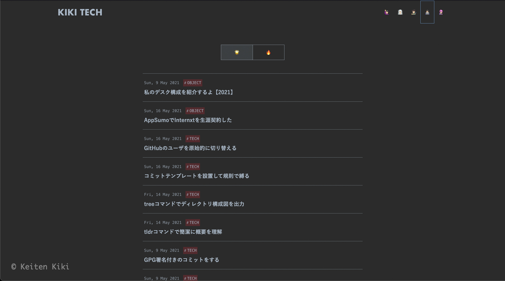
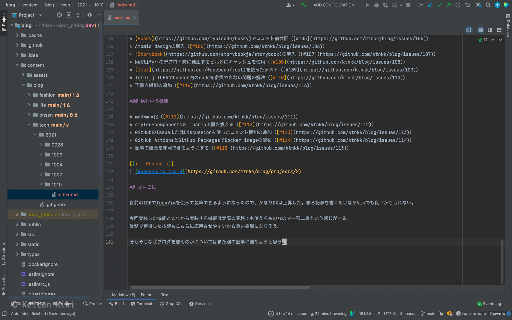

以前はWordPressを使ってブログ運営をしていた。
しかし、様々な面倒に直面したのとDXが良くない（書く気にならない）ので勉強も兼ねて1からブログを作っていくことにした。
隙間時間を見つけてはコードを試すのを繰り返し、大体4週間ほどで公開できる段階まで来た。

以下リンクが管理しているリポジトリ。Publicなのでどんどんプルリクを出して頂けるとありがたいです。
コントリビュータお待ちしております。

[[i | GitHubリポジトリ]]
| https://github.com/ktnkk/blog

## 前回の反省

[WordPress](https://github.com/WordPress/WordPress)は素晴らしいCMSであり、批判をするつもりは更々ないけど個人的には下記の項目がとてもストレスであった。

* 記事を書くためにブラウザを立ち上げてWebエディタまで移動しなければならない
* WYSIWYGで出力されたHTMLの汎用性の無さ
* 使わない機能が多いので目障り
* **頻繁なアップデート**
* **セキュリティの脆弱性**
* 単純にパフォーマンスが悪い
* マスターしても単価が低いので仕事としての展望がない
* サーバを管理する必要がある
* VPSの料金が高い

要するに面倒くさがりなのと、出来るだけシンプルな環境を求めていたということになる。
WordPressは成熟しすぎた。「[UNIXという考え方](https://www.amazon.co.jp/UNIX%E3%81%A8%E3%81%84%E3%81%86%E8%80%83%E3%81%88%E6%96%B9%E2%80%95%E3%81%9D%E3%81%AE%E8%A8%AD%E8%A8%88%E6%80%9D%E6%83%B3%E3%81%A8%E5%93%B2%E5%AD%A6-Mike-Gancarz/dp/4274064069)」という本があるけど、その中で言う「人間による第二のシステム」の末期に差し掛かっている。

## 技術スタック

前回の反省を生かして以下の項目を満たす技術選定を行った。

* **記事執筆**
    * オフライン対応
    * お気に入りのIDE（Intellij IDEA）使用可能性
    * マークダウン対応
    * 再利用性の高さ
    * プレビュー（ホットリロード）対応
* **技術**
    * サーバレス
    * SPA（Single Page Application）
    * SSG（Static Site Generator）
    * 無料
    * 仕事に活かせるかどうか（モダンな技術）
    * デプロイの容易さ

今回選んだ技術に関してまだ完全に理解できていない部分も多いが、何度落ちても問題ない個人ブログであるから積極的に最新技術を試すサンドボックスとして活用していきたい。
ブログに接続できなければ何かしら試して失敗しているなと暖かい目で見て頂ければ幸いです。

### ドメイン -> Njalla

ドメインは匿名性を重視してスウェーデン発のサービスである[Njalla](https://njal.la/)を使ってみた。

通常であればドメインを取得する際に連絡先住所を登録してからWhoisで照会後にレジストラが代理で連絡先を公開してくれる。
しかし、これでもレジストラに個人情報が渡ってしまうと言う意味では匿名性は担保されていない。

Njallaの場合はドメインの所有権がNjalla自身にあり、サービス利用者はそれを借りる形で完全なる匿名性を実現している。
利用者は一切個人情報を登録する必要がない（メールアドレスの代わりにXMPP、クレジットカードの代わりに仮想通貨を使用できる）。

当ブログでは匿名性を大きなテーマとして扱っていきたいので試しに使ってみた。
各サービス間でVPNサーバを切り替えたり、支払い方法などを変えたり匿名性を保つための工夫もしたが長くなるので割愛する。

### フロントエンド -> Gatsby.js & TypeScript

マークダウン対応やSSGを実現するためにフロントエンドのフレームワークは[Gatsby.js](https://github.com/gatsbyjs/gatsby)を選択した。
主要なフレームワークとして[Next.js](https://github.com/vercel/next.js)もあるがSSRは使わないのと強力なプラグイン機構が使えるという面でGatsby.jsの方がブログ向きかなと判断した。

また、せっかくなのでJavaScriptではなくTypeScriptで書いていく（勝手が分からないけど）。
今のところGraphQLから自動的に型定義を吐き出す設定にしているが各コンポーネントで定義していないので順次対応させていきたい。

### ホスティング -> Netlify

フロントエンドのデプロイ先としては[Netlify](https://www.netlify.com)を選択した。
GitHubと連携させることでわずか5分足らずで全世界にブログを公開することができた。

このブログの規模であれば無料枠でやっていけるので経済的にも助かっている。結局、ブログの運営費はドメイン代の年間$15だけである。
WordPress時代はConoHa VPSに年間1.5万円ほど納めていたから節約になった。

他にもVercelやFirebase Hostingなど似たようなサービスがあるが、どれも無料で試せるのでスピードの比較をしてみたい。
Netlifyは日本にCDNのエッジがないのがネックかな。今のところ不便は感じていないが。

### その他のこだわりポイント

#### Twemoji

ブログカードとアイキャッチには絵文字を使用している。これは[Twemoji](https://github.com/twitter/twemoji)を使って絵文字をSVGに変換したものだ。
このアイディアはZennから拝借した。
記事のFrontmatterに絵文字を設定するだけで面倒なアイキャッチ画像を作る手間が省けるので時間の節約に繋がった。

#### styled-components

Reactのスタイリング方法に関しては様々な論争の元になるが、当ブログではCSS in JSの雄である[styled-components](https://github.com/styled-components/styled-components)を使用している。
今後、Atomic designと関数型の概念を取り入れていきたいので最も相性が良いCSS in JSを選択した。

ただし、レンダリングコストの問題もあり、styled-componentsより後発の[emotion](https://github.com/emotion-js/emotion)か[linaria](https://github.com/callstack/linaria)の導入を検討している。

#### カテゴリのサブモジュール化

当ブログの記事は`blog/content/blog/*`に存在するが各カテゴリ毎にサブモジュールを作成している。

* [fashion](https://github.com/ktnkk/blog.fashion)
* [life](https://github.com/ktnkk/blog.life)
* [onsen](https://github.com/ktnkk/blog.onsen)
* [tech](https://github.com/ktnkk/blog.tech)

サブモジュール化することで再利用性を高められる。
例えば後発でGatsby.jsに変わる新たなフレームワークが出てきたら外枠さえできればサブモジュールと紐づけることですぐに記事の移植ができる。

他にもブログ本体と記事のプルリクを分けられるので運用もしやすい。

## 開発ロードマップ

マーク・サッカーバーグが言うように完璧を目指すよりもまずは終わらせることが先決であるから未完成だけどリリースした。
時間が足りずに後回しにしている機能も含めて洗いざらい吐き出しておく。

### 必ず欲しい機能

* 画像フォーマットのWebP対応（[#8](https://github.com/ktnkk/blog/issues/8)）
* 動的なOGP画像の生成（[#10](https://github.com/ktnkk/blog/issues/10)）
* シェルスクリプトで対話的にFrontmatterを自動生成（[#11](https://github.com/ktnkk/blog/issues/11)）
* サイドバーにプロフィール（[#100](https://github.com/ktnkk/blog/issues/100)）
* 記事のサイドバーにスクロールスパイ付き目次（[#101](https://github.com/ktnkk/blog/issues/101)）
* タグ機能の追加（[#102](https://github.com/ktnkk/blog/issues/102)）
* [Algolia](https://www.algolia.com/)を使った全文検索（[#103](https://github.com/ktnkk/blog/issues/103)）
* [textlint](https://github.com/textlint/textlint)で記事校正の自動化（[#104](https://github.com/ktnkk/blog/issues/104)）
* [Husky](https://github.com/typicode/husky)でコミット前検証（[#105](https://github.com/ktnkk/blog/issues/105)）
* Atomic designの導入（[#106](https://github.com/ktnkk/blog/issues/106)）
* [Storybook](https://github.com/storybookjs/storybook)の導入（[#107](https://github.com/ktnkk/blog/issues/107)）
* Netlifyへのデプロイ時に発生するビルドにキャッシュを使用（[#108](https://github.com/ktnkk/blog/issues/108)）
* [Jest](https://github.com/facebook/jest)を使ったテスト（[#109](https://github.com/ktnkk/blog/issues/109)）
* Intellj IDEAでDocker内のnodeを参照できない問題の解決（[#110](https://github.com/ktnkk/blog/issues/110)）
* 下書き機能の追加（[#116](https://github.com/ktnkk/blog/issues/116)）

### 検討中の機能

* mdのmdx化（[#111](https://github.com/ktnkk/blog/issues/111)）
* styled-componentsをlinariaに置き換える（[#112](https://github.com/ktnkk/blog/issues/112)）
* GitHubのIssueまたはDiscussionを使ったコメント機能の追加（[#113](https://github.com/ktnkk/blog/issues/113)）
* GitHub ActionsとGitHub PackagesでDocker imageの配布（[#114](https://github.com/ktnkk/blog/issues/114)）
* 記事の履歴を参照できるようにする（[#115](https://github.com/ktnkk/blog/issues/115)）

[[i | Projects]]
| [Roadmap to 2.0.0](https://github.com/ktnkk/blog/projects/2)

## さいごに

自前のIDEでIdevVimを使って執筆できるようになったので、かなりDXは上昇した。寧ろ記事を書くだけならVimでも良いかもしれない。

今回実装した機能とこれから実装する機能は実際の業務でも使えるものなので一石二鳥という感じがする。
業務で習得した技術もこちらに応用させやすいから良い循環になりそう。

そもそもなぜブログを書くのかについてはまた別の記事に纏めようと思う。