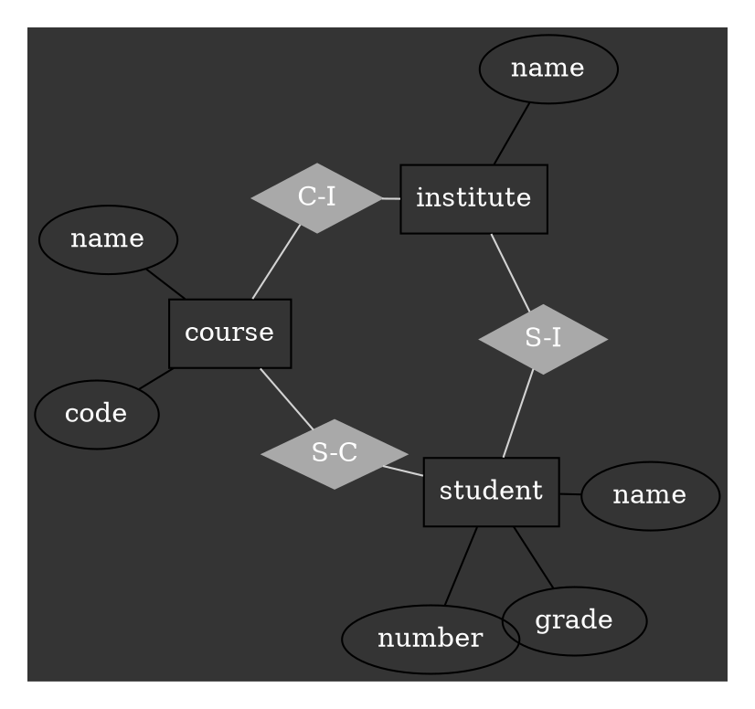

当ブログのマークダウン記法とそれに対応する表示をテストするために全て書き留めておく。機能追加していく中でデグレ起こすかもしれないので。

実際はあまり使ってない記法もあるけど……。これを機に活用していきたいです。

***

## Heading

```markdown:title=Markdown
## Heading level 2
### Heading level 3
#### Heading level 4
##### Heading level 5
```

## Heading level 2

### Heading level 3

#### Heading level 4

##### Heading level 5

***

## List

### ul

```markdown:title=Markdown
* first item
  * (first item)
* second item
  * (second item)
* third item
  * (third item)
```

* first item
    * (first item)
* second item
    * (second item)
* third item
    * (third item)

### ol

```markdown:title=Markdown
1. first item
2. second item
3. third item
4. fourth item
5. fifth item
```

1. first item
2. second item
3. third item
4. fourth item
5. fifth item

***

## Inline text

```markdown:title=Markdown
*stress emphasis*
**strong importance, seriousness, or urgency**
~~text that has been deleted from a document~~
`short fragment of computer code`
[This is my homepage](https://ktnkk.com)
```

*stress emphasis*

**strong importance, seriousness, or urgency**

~~text that has been deleted from a document~~

`short fragment of computer code`

[This is my homepage](https://ktnkk.com)

***

## Table

```markdown:title=Markdown
| Countries | Capitals | Population | Language |
| --- | --- | --- | --- |
| USA | Washington, D.C. | 309 million | English |
| Sweden | Stockholm | 9 million | Swedish |
```

| Countries | Capitals | Population | Language |
| --- | --- | --- | --- |
| USA | Washington, D.C. | 309 million | English |
| Sweden | Stockholm | 9 million | Swedish |

***

## Image

```markdown:title=Markdown

```


### Resize

```markdown:title=Markdown
[[imgM]]
| 

[[imgS]]
| 
```

[[imgM]]
| 

[[imgS]]
| 

***

## Custom block

```markdown:title=Markdown
[[s | Simple ]]
| It's simple of you to be taken in by such a story.

[[i | Info]]
| A lot of GNU/FSF software is provided with info files.

[[n | Notice]]
| The act of taking no notice of something.

[[a | Alert ]]
| * The soldiers were on the alert
| * Look around with alert eyes
```

[[s | Simple ]]
| It's simple of you to be taken in by such a story.

[[i | Info]]
| A lot of GNU/FSF software is provided with info files.

[[n | Notice]]
| The act of taking no notice of something.

[[a | Alert ]]
| * The soldiers were on the alert
| * Look around with alert eyes

## Horizontal Rule

```markdown:title=Markdown
***
```

***

## YouTube

```markdown:title=Markdown
`youtube:https://www.youtube.com/watch?v=jNQXAC9IVRw`
```

`youtube:https://www.youtube.com/watch?v=jNQXAC9IVRw`

***

## Twitter

```markdown:title=Markdown
<blockquote class="twitter-tweet" data-lang="ja" data-theme="dark">
  <p lang="en" dir="ltr">just setting up my twttr</p>
  &mdash; jack⚡️ (@jack)
  <a href="https://twitter.com/jack/status/20?ref_src=twsrc%5Etfw">2006年3月21日</a>
</blockquote>
```

<blockquote class="twitter-tweet" data-lang="ja" data-theme="dark">
  <p lang="en" dir="ltr">just setting up my twttr</p>
  &mdash; jack⚡️ (@jack)
  <a href="https://twitter.com/jack/status/20?ref_src=twsrc%5Etfw">2006年3月21日</a>
</blockquote>

* data-lang: 表示する言語
* data-thema: ライトモードかダークモードか
* `&mdash;`: フォントサイズのダッシュ

***

## Code

### Basic

<div class="gatsby-code-title">Markdown</div>
<div class="gatsby-highlight" data-language="markdown"><pre class="language-text"><code class="language-text">```javascript:title="gatsby-config.js
plugins: [
  {
    resolve: `gatsby-remark-prismjs`,
    options: {
      classPrefix: "language-",
      inlineCodeMarker: null,
      aliases: {},
      showLineNumbers: false,
      noInlineHighlight: false,
      prompt: {
        user: "",
        host: "",
        global: true,
      },
      escapeEntities: {}
    }
  }
]
```</code></pre></div>

```javascript:title=gatsby-config.js
plugins: [
  {
    resolve: `gatsby-remark-prismjs`,
    options: {
      classPrefix: "language-",
      inlineCodeMarker: null,
      aliases: {},
      showLineNumbers: false,
      noInlineHighlight: false,
      prompt: {
        user: "",
        host: "",
        global: true,
      },
      escapeEntities: {}
    }
  }
]
```

### Line highlighting

<div class="gatsby-code-title">Markdown</div>
<div class="gatsby-highlight" data-language="markdown"><pre class="language-text"><code class="language-text">```java{4,6-7}:title=Console.java
public class Console {
    public static void main(String[] args) {
        System.out.println("3");
        System.out.println("4");
        System.out.println("5");
        System.out.println("6");
        System.out.println("7");
        System.out.println("8");
    }
}
```</code></pre></div>

```java{4,6-7}:title=Console.java
public class Console {
    public static void main(String[] args) {
        System.out.println("3");
        System.out.println("4");
        System.out.println("5");
        System.out.println("6");
        System.out.println("7");
        System.out.println("8");
    }
}
```

### Shell prompt

<div class="gatsby-code-title">Markdown</div>
<div class="gatsby-highlight" data-language="markdown"><pre class="language-text">
<code class="language-text">```shell:title=Bash {outputLines: 2, 4}{}
echo "shell prompt"
shell prompt
echo $USER
ktnkk
```</code></pre></div>

```shell:title=Bash {outputLines: 2, 4}{}
echo "shell prompt"
shell prompt
echo $USER
ktnkk
```

<div class="gatsby-code-title">Markdown</div>
<div class="gatsby-highlight" data-language="markdown"><pre class="language-text"><code class="language-text">```shell:title=Bash {outputLines: 2}{promptUser: root}
echo $USER
root
```</code></pre></div>

```shell:title=Bash {outputLines: 2}{promptUser: root}
echo $USER
root
```

### Diff code blocks

<div class="gatsby-code-title">Markdown</div>
<div class="gatsby-highlight" data-language="markdown"><pre class="language-text"><code class="language-text">```diff:title=Dockerfile
- FROM node:16.11.0-bullseye-slim
+ FROM node:16.11.1-bullseye-slim
  LABEL maintainer="ktnkk@pm.me"
  LABEL version="1.0.0"
```</code></pre></div>

```diff:title=Dockerfile
- FROM node:16.11.0-bullseye-slim
+ FROM node:16.11.1-bullseye-slim
  LABEL maintainer="ktnkk@pm.me"
  LABEL version="1.0.0"
```

***

## KaTeX

### Centered

```markdown:title=Markdown
$$
i \hbar \dfrac{\partial}{\partial t} \psi(r,t) 
= \left(- \dfrac{\hbar^2}{2m} \nabla^2+ V(r,t) \right) \psi(r,t)
$$
```

$$
i \hbar \dfrac{\partial}{\partial t} \psi(r,t)
= \left(- \dfrac{\hbar^2}{2m} \nabla^2+ V(r,t) \right) \psi(r,t)
$$

### Left-aligned

```markdown:title=Markdown
$
\rho \left\{\dfrac{\partial{\boldsymbol{v}}}{\partial{t}} + \left(\boldsymbol{v} \cdot \nabla \right) \boldsymbol{v}\right\} 
= -\nabla p + \mu \nabla^2 \boldsymbol{v} + \rho \boldsymbol{f}
$
```

$
\rho \left\{\dfrac{\partial{\boldsymbol{v}}}{\partial{t}} + \left(\boldsymbol{v} \cdot \nabla \right) \boldsymbol{v}\right\}
= -\nabla p + \mu \nabla^2 \boldsymbol{v} + \rho \boldsymbol{f}
$

### Inline

```markdown:title=Markdown
Let $\begin{pmatrix} 3 \\ 4 \\ 5 \end{pmatrix}$ be the matrix in the text.
```

Let $\begin{pmatrix} 3 \\ 4 \\ 5 \end{pmatrix}$ be the matrix in the text.

***

## Graphviz

```text:title=Markdown
graph ER {
  graph [
    charset = "UTF-8";
    bgcolor = "#343434",
    fontcolor = lightgrey,
    margin = 0.2,
  ];
  layout=neato
  node [
    shape=box,
    fontcolor=white
  ];
  course; institute; student;
  node [
    shape=ellipse
  ];
  {node [label="name"] name0; name1; name2;}
  code; grade; number;
  node [
    shape=diamond,
    style=filled,
    color=darkgrey
  ];
  "C-I"; "S-C"; "S-I";

  name0 -- course;
  code -- course;
  course -- "C-I" [color=lightgrey];
  "C-I" -- institute [color=lightgrey];
  institute -- name1;
  institute -- "S-I" [color=lightgrey];
  "S-I" -- student [color=lightgrey];
  student -- grade;
  student -- name2;
  student -- number;
  student -- "S-C" [color=lightgrey];
  "S-C" -- course [color=lightgrey];
}
```



※ 言語は`dot`を指定（レンダリングされてしまうので上記で書けず）。

***

## あとがき

基本的なマークダウンの記法通りで特に真新しさはない。
違うところはカスタムブロックとコードブロック、KaTaX、Graphvizくらいかな。

マークダウンの良さは互換性の高さだと思っている。
母艦が変わっても表示の一貫性が保たれているので、記録として残したい構造的な文章を書くのに打って付けだ。

だが、そう考えるとマークダウンの機能を拡張していくことはそのメリットを打ち消す気がする。
[MDX](https://mdxjs.com/)を使うことでマークダウン内にコンポーネントを書けるようにする方法もあるが、それはライブラリがReactであるから成り立つことでもある。

今後は闇雲に機能を追加するのではなく、本当に必要な記法だけを厳選して追加したい。MDXを使うなら別のモジュールとして管理すればアリかな。

あと、[Graphviz](https://graphviz.org/)面白いね。これ（DOT言語）をマスターすれば表を書くのにわざわざアプリを使わずに済むし、修正も容易だ。
