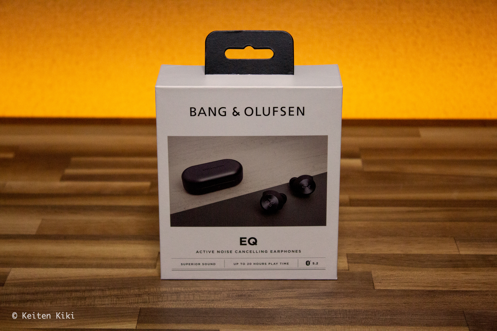
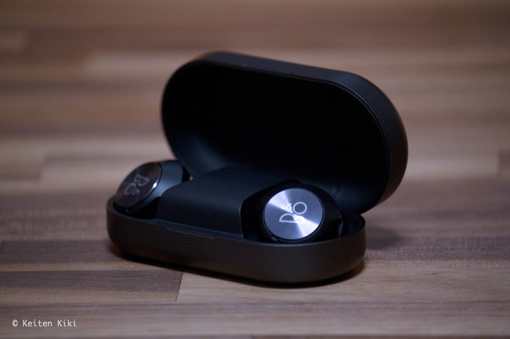
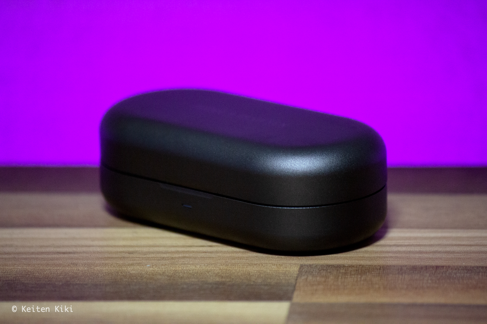

## プロローグ

生活するうえで多くの時間を共にするアイテムにはお金をかけるべきである。
これが買い物をするときのマニフェストなのだが、ふとした拍子に在宅勤務や通勤でイヤホンを付けている時間が多いことに気づいた。

ここ半年ほどは Apple の [AirPods Pro](https://www.amazon.co.jp/Apple-%E3%82%A2%E3%83%83%E3%83%97%E3%83%AB-MWP22J-A-AirPods/dp/B07ZPS4FSW) を使っていた。
ノイズキャンセリングの優秀さも含めて特に悪いことはないのだけれど、更なる音質を求めて新しいワイヤレスイヤホンを買ったのでレビューしてみる。

## BeoPlay EQ

今回購入したのはデンマーク生まれのブランド Bang & Olufsen の [Beoplay EQ](https://www.amazon.co.jp/Bang-Olufsen-ノイズキャンセリング完全ワイヤレスイヤホン-Beoplay-Adaptive対応/dp/B08WLXRHFJ) である。
予算としては4万円前後で、以下のイヤホンが選択肢に上がった。

* [Bowers & Wilkins PI7](https://www.amazon.co.jp/Bowers-Wilkins-Sound-完全ワイヤレス・インイヤーヘッドホン-PI7/dp/B092473GYM)
* [Master & Dynamic MW08](https://www.amazon.co.jp/Master-Dynamic-ノイズキャンセリング完全ワイヤレスイヤホン-連続再生12時間-Apt-X対応/dp/B091G2BX1M)
* [Devialet Gemini](https://www.amazon.co.jp/Devialet-Inc-LX608-完全ワイヤレスANCイヤホン-Gemini/dp/B08KSM9W7X)
* [JVC HA-FW1000T](https://www.amazon.co.jp/JVCケンウッド-HA-FW1000T-完全ワイヤレスイヤホン-ノイズキャンセリング機能-ウッドドームカーボン振動板/dp/B09HGGWSZL)

いずれのイヤホンも音質には定評があるようで、好みの部分が決め手になると感じた。
けっこう悩んだけど最終的にはデザインがもっとも洗練されている Beoplay EQ を購入。

## 主観的レビュー

価格.com風にレビューを書いていく。
今までに購入したイヤホンでは SHURE の [SE425](https://www.amazon.co.jp/SHURE-SEシリーズ-SE425-SE425-CL-【国内正規品】/dp/B07DNKZ74Y) がもっとも高額である。
それ以上の音質を体験したことがないのと美的感覚のズレに伴う思考の偏りがある点に留意されたし。

### デザイン

先ほども書いたが、デザインは購入するうえで大きなポイントであった。
デザイナーは [Thomas Bentzen](https://thomasbentzen.com/) 。
存じ上げなかったが、調べてみると家具デザインで有名とのことである。
ザ・北欧デザインって感じ。

ケースを開けた瞬間にこれほどワクワクするイヤホンは初めてだ。
色はブラックとのことだが、真っ黒ではなく炭黒といった方が適切である。。
ハウジングにはスピン加工が施されており、光の反射が上品な質感を際立たせる。

（なぜか紫）

イヤホン本体のデザインも素晴らしいが、何よりケースが美しい。
机の上にポンと置いておくだけで様になる。
素材はスペースクラフテッド硬化アルマイト加工アルミニウムとのこと。
アルマイト加工は耐久性を高めると同時に、使い込むことで味が出る加工なのでこれからのエイジングが楽しみである。

***

### 高音の音質

開封直後に試聴したところ想像していたよりもシャリシャリした音がして眉を顰めた。
その時は悪い意味でショックだったが、20時間ほどのエイジング（ピンクノイズ）を経て再び聴いてみたところ音質が向上した（気がする）。

総合的にみると原音主義というか、変に誇張していない繊細かつ上品な音を出す点は気にいっている。
ワープレコーズ系のテクノミュージックや現代寄りのクラシック音楽を聴く機会が多いのだが、今まで聴き過ごしていた些細な音を拾うので新たな発見があり、日々の音楽鑑賞が楽しくなった。
聴き始めたときの感動を再び味わっている感じ。

***

### 低音の音質

そこまで低音を重視した設計ではないと感じている。
低音が好きであればまずこのイヤホンは選択肢には入らないだろう。
ただ、それが悪いという訳ではなく、必要最低限の低音であるからこそ楽曲の良さを引き立たせているとも言える。
もし物足りないようであればアプリのイコライザで多少調節できるのでそこにはバッファがある。

ちなみにサウンドコーデックは AAC と aptX に対応している。
現在は iPhone をメインで使っているので AAC で問題はないが、今後 Android に移行予定のため aptX に対応しているのはありがたい。

***

### フィット感

付属品としてシリコン製イヤーチップとコンプライ™（多分ノーマルタイプ）がついている。
最初はシリコンを装着してみたのだけれどいずれも合わなかった。
フィット感を重視する場合は必然的にコンプライ™を使うことになるだろう。

付属しているコンプライ™はMサイズなのでちょっと小さく感じた。
別途 Amazon で [Ts-200 L](https://www.amazon.co.jp/gp/product/B00DGNON1K) を購入したがこれは大きくて耳が痛くなった。
この辺の微妙なサイズ感を埋めることでさらに高音質を追求できそうな気がしている。
次はMサイズのアジアンフィット（ [Ts-200 M](https://www.amazon.co.jp/Comply-WF-SP700N-イヤホンアップグレード-脱落防止イヤーピース-「国内正規品」HC23-20502-01/dp/B01GDJNCBA) ）を試してみる予定。

イヤホン本体は AirPods Pro の装着感には劣るものの悪くはない。
ジムで使っているが今のところ外れそうになったこともない。
ただし、これは耳の形によるとしか言えない。
話は変わるがイヤホンによって耳の形が変わるとこはあるのだろうか。
大きいサイズを使うことで耳の穴が大きくなるのはなんだか嫌だな。

***

### 外音遮断性

これはちょっと残念な結果だった。
存在価値を音質に振っているのでしょうがないといえばそれまでだけど。
具体的には風切り音や服が擦れる音に弱い。
室内で使うことを想定している場合は十分に効果を発揮してくれるが、国道沿いを通ると車の音でせっかくの高音質が減退してしまう。
AirPods Pro のノイキャンが優秀だっただけにそこの落差はどうしても感じざるを得ない。

外音取り込みの機能は悪くない。
買い物に行っても基本的にイヤホンを外さない主義だからこの機能はとても助かる。

***

### 操作性

|| 左 | 右 |
| ---| --- | --- |
| 2回タップ | ANC -> 外音取り込み -> ニュートラル | 再生 <-> 停止 |
| 長押し | 音量 down | 音量 up |

音量調節機能は要らないから曲送りの機能を追加してほしいと切に願っている。
そもそも音量調節することは滅多にないし、装着時に誤作動を起こすから長押しの機能も必要ないと個人的には考えている。

理想は以下のような形。

|| 左 | 右 |
| ---| --- | --- |
| 2回タップ | ANC -> 外音取り込み -> ニュートラル | 再生 <-> 停止 |
| 3回タップ | 曲戻し | 曲送り |

同じような考えを持っている人も多いだろうから今後のアップデートに期待。

## さいごに

[[imgS]]
| 

Spotify によると今年は現時点で 43,967 分再生していたそうだ。
購入したイヤホンの価格が 36,273 円だったから計算すると1分あたりの金額は約 0.825 円ということになる。
少なくともあと1, 2年は使えるだろうから、そう考えると決して高い買い物ではない。

1日のスタートにベートーヴェンの交響曲第5番を聴くのがルーティンだが、あの運命が扉を叩く（?）音の響きが向上しただけでもやる気が漲るし購入した甲斐があったといえる。
イヤホンやヘッドホンは沼の世界だからあまり近寄らないようにしていたけど半分ほど足を取られてしまった。

音質を追求するのであれば有線に軍配が上がるのは間違いないが、あくまで Bluetooth の領域を追求していきたい。
とりあえず次に考えられる選択肢としてはアンプ内臓の Bluetooth レシーバーかな。
