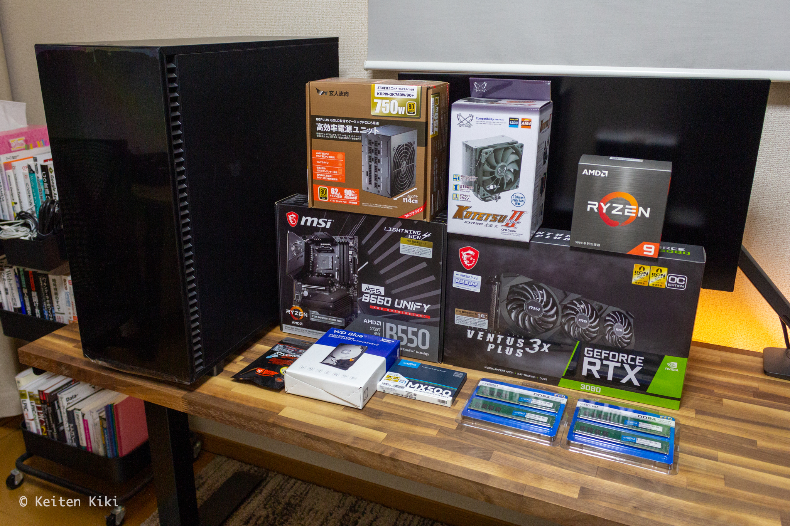
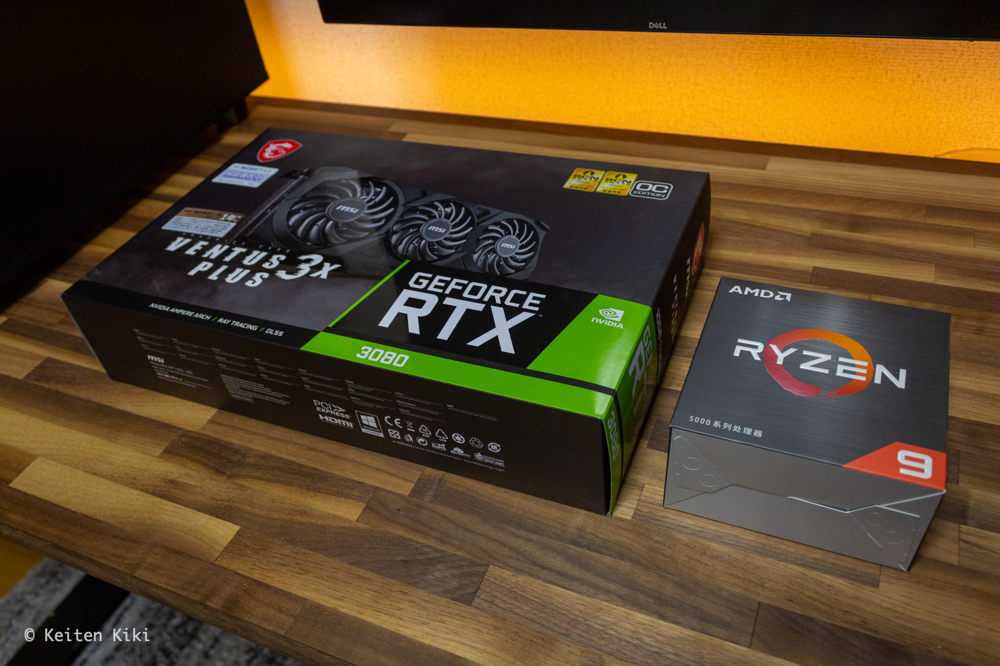
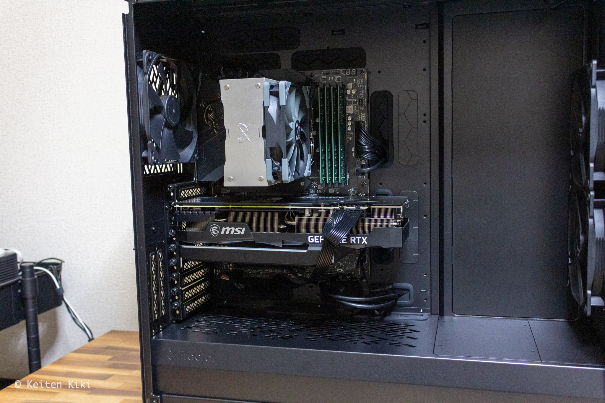
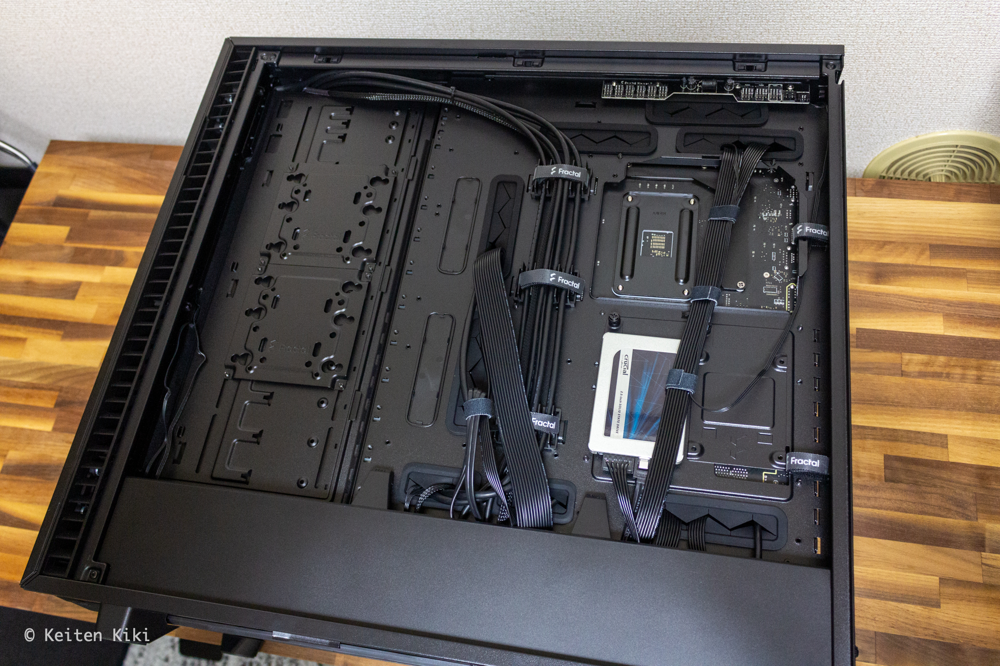
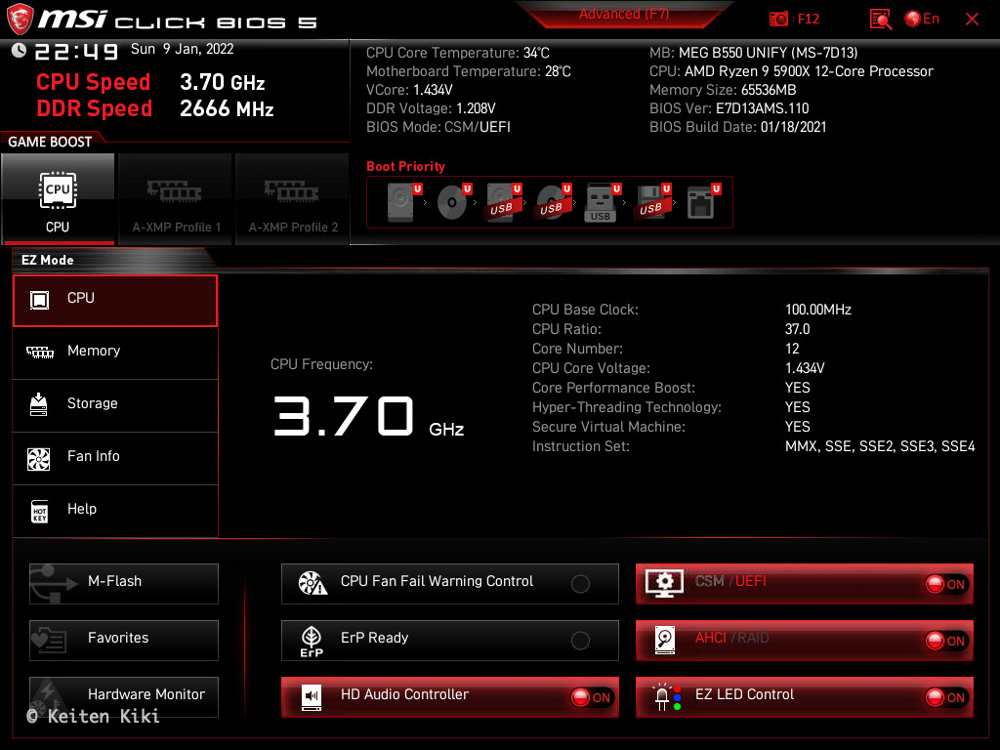

## モチベーション

以前から「今は時期が悪い」ということで延期していた自作 PC の制作だが、これ以上待っても半導体不足は解消されそうもないので思い切って作ることにした。
基本的には開発に使う予定。だが、それだけでは明らかにオーバースペックでもったいないので今後は 3D レンダリングや機械学習とフルに活躍してもらう。
オーバースペックというとネガティブな単語だが、電気代が掛かるぐらいで他にデメリットはない。
むしろ過剰な性能は余計なストレスを溜めずに済むので好都合である。

とりあえずパーツを組んで BIOS 画面が表示されるまで進めることにする。

## パーツ構成

- CPU: [AMD Ryzen 9 5900X](https://www.amazon.co.jp/dp/B08164VTWH/)
- GPU: [MSI GeForce RTX 3080 VENTUS 3X PLUS](https://www.amazon.co.jp/dp/B09FSWGS7L/)
- マザーボード: [MSI MEG B550 UNIFY](https://www.amazon.co.jp/dp/B08PKGDX83/)
- SSD: [Crucial 1000GB MX500](https://www.amazon.co.jp/dp/B077PSMJZS/)
- HDD: [Western Digital 6TB WD Blue](https://www.amazon.co.jp/dp/B0858VP66C/)
- メモリ: [Crucial DDR4-3200 16GB](https://www.amazon.co.jp/dp/B08SVXPD79/) × 4
- 電源: [玄人志向 80 PLUS GOLD 認証 750W](https://www.amazon.co.jp/dp/B0778WKJ1Y/)
- ケース: [Fractal Design Define 7 XL Black](https://www.amazon.co.jp/dp/B084SZDJWM/)
- CPU クーラー: [虎徹 Mark II](https://www.amazon.co.jp/dp/B072PWL5YF/)
- CPU グリス: [Thermal Grizzly](https://www.amazon.co.jp/dp/B011F7W3LU/)

Ryzen9 のハイエンドモデルは 5950X であるが、4 コア 12 スレッドの違いで 3 万円はちょっと高いなと感じたので 5900X に。
それでも 12 コア 24 スレッドあれば必要十分だろう。
ちなみに多少安かったので中国版を購入した。中身は同じ。

グラボは MSI の RTX 3080 を選んだ。MSI にしたのはマザボが MSI だから。特に意味はない。
それにしてもグラボの値段は高いな。
価格.com でしばらく監視していたが、半年前に比べれば価格が落ち着いたのと、これから大幅に値下がりすることはなさそうだから購入した。
CPU とグラボで 23 万円…。それなりに良いノート PC が買えそうな値段だ。
とはいえ、それ以上の価値を生み出してくれるだろうから後悔はしていない。
この性能はノート PC では出せないからね。

データストレージはオーソドックスに SSD と HDD の構成にした。
後述するが複数の OS をそれぞれの SSD に入れる予定である（マルチブート）。
メインとして使う OS（Arch Linux）を格納する SSD のインタフェースは耐久性を重視してあえて SATA3.0 にしている。
他の OS は実験用に使うので M.2 SSD を使う予定。
最近は SSD の価格もかなり下がってきているので全てのストレージを SSD で組むこともできるが（夢の構成）、やはり HDD の耐久性は捨て難い。
SSD は前触れもなく壊れるからリスクを考えるとバックアップストレージの代替品に使うことは今後もないだろう。

## 組み立て

全く光らない無骨な見た目に仕上がった。
個人的にピカピカ光るのはダサくてどうしても受け付けない。
写真ではマザボが小さく見えるがそれだけケースが大きいということである。
右側のスペースが余っているので冷却性能を上げるための施策に使いたい。
せっかくなら CPU クーラーは簡易水冷にしておけばよかったな。
[これ](https://www.amazon.co.jp/dp/B09LQ949JG) とか良さげ。

フルタワーケースなので楽々組み立てられると踏んでいたが、サイズが大きい分だけ電源コードがギリギリになってしまい焦った。
それが今回唯一の失策。
けっこう無理して付けているので今後はちょっと心配だな。
配線はコードが短くて自由が効かなかったため適当。

特に問題は発生せず、無事に BIOS 画面が表示された。
メモリやストレージもちゃんと認識していて安心した。
OS を入れたりは後日行う予定である。

## 拡張予定

とりあえず最低限の構成で組み立てたが、自作 PC は自由に拡張できるのが最大のメリット。
今後はどんどん盛っていく。

- M.2 SSD を 3 つ追加（B550 UNIFY は最大 4 つも付けられる）
  - 1TB: Windows11 用
  - 500GB: Kali Linux 用
  - 500GB: Tails 用
- HDD の冗長化
  - NAS も使いたい
- 光学ドライブの追加
- 空調を整える
- （本格水冷）
- ベンチマーク測定
- オーバークロック
