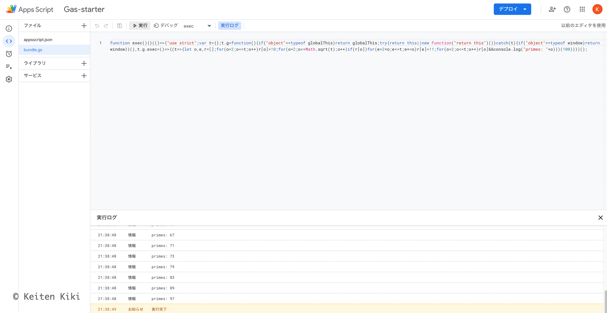

## モチベーション

GAS（Google Apps Script）はスプレッドシートなどの各種サービスと連携できるだけではなく、GCP プロジェクトとしても拡張できるなど無限の可能性を秘めている。
Google は嫌いだが、フロントエンドの技術を語る上では避けては通れない道だ。

そんな素晴らしい GAS だがいくつか欠点がある。
まず 1 つ目は JavaScript にしか対応していない点。
2 つ目はブラウザ上のエディタが非常に使いづらい点である。
他にも上げたらキリがないけど、無料で使えるので文句は言えない。

だが、それらを解決する方法をソフトウェアの神 Google は生み出していた。
[clasp](https://github.com/google/clasp) を使うことでローカルで書いたコードを GAS 上にデプロイできる。
しかも、TypeScript で書ける。
ローカルで書けるということは Git でバージョン管理できるのでテンプレートを作って使い回していく。

[gas-starter](https://github.com/ktnkk/gas-starter)

## 開発環境

```shell:title=Zsh {outputLines: 2-13, 15-18, 20-21, 23-24, 26}{}
system_profiler SPHardwareDataType
Hardware:

    Hardware Overview:

      Model Name: MacBook Pro
      Model Identifier: MacBookPro17,1
      Chip: Apple M1
      Total Number of Cores: 8 (4 performance and 4 efficiency)
      Memory: 16 GB
      System Firmware Version: 6723.140.2
      OS Loader Version: 6723.140.2

sw_vers
ProductName:	macOS
ProductVersion:	12.1
BuildVersion:	21C52

node -v
v16.13.0

yarn -v
1.22.17

yarn info clasp version
1.0.0
```

## clasp の導入

まずは clasp をインストールする。
TypeScript で書く場合は型定義も一緒にインストールしておく。

```shell:title=Zsh
yarn add -D @google/clasp @types/google-apps-script
```

次に Google アカウントにログインする。
もし、Docker 環境の場合は `--no-localhost` オプションを付けて遷移しないようにする。

```shell:title=Zsh
yarn clasp login
```

ホームディレクトリ以下の `.clasprc.json` が作成されて、そこに認証情報などが保存される。
早速スクリプトを作ってみる。

```shell
yarn clasp create
? Create which script? standalone
User has not enabled the Apps Script API. Enable it by visiting https://script.google.com/home/usersettings then retry. If you enabled this API recently, wait a few minutes for the action to propagate to our systems and retry.
error Command failed with exit code 1.
info Visit https://yarnpkg.com/en/docs/cli/run for documentation about this command.
```

対話式で下記の選択肢から選べる。

- standalone
- docs
- sheets
- slides
- forms
- webapp
- api

今回はただ出力を確認したいだけなので `standalone` を選択してみたが、エラーが表示されてしまった。
エラー文には `User has not enabled the Apps Script API.` とあるので `https://script.google.com/home/usersettings` に飛んで設定を有効にする。
これで簡単に環境を整えることができた。

以下のファイルが作成された。

```json:title=.clasp.json
{
  "scriptId": "1ALBIR05qQsOOx4T5UijrC-kstM85dxIXbUejblTCc02gOv_JjRpfpu-D",
  "rootDir": "/Users/ktnkk/Project/gas-starter"
}
```

```json:title=appsscript.json
{
  "timeZone": "America/New_York",
  "dependencies": {},
  "exceptionLogging": "STACKDRIVER",
  "runtimeVersion": "V8"
}
```

`.clasp.json` はプロジェクトの設定ファイル、`appsscript.json` はマニフェストファイルである。
デフォルトの設定から下記の項目を変更する。

```diff:title=.clasp.json
{
  "scriptId": "1ALBIR05qQsOOx4T5UijrC-kstM85dxIXbUejblTCc02gOv_JjRpfpu-D",
- "rootDir": "/Users/ktnkk/Project/gas-starter"
+ "rootDir": "./dist"
}
```

```diff:title=appsscript.json
{
- "timeZone": "America/New_York",
+ "timeZone": "Asia/Tokyo",
  "dependencies": {},
  "exceptionLogging": "STACKDRIVER",
  "runtimeVersion": "V8"
}
```

`.clasp.json` に `"fileExtension": "ts"` を追加すると TypeScript をトランスパイルできるが、clasp の機能ではなく Webpack を使うのであえて書かない。
なぜデフォルトの機能を使わないのかというと import / export が使えないからである。
小さなスクリプトなら良いけど、ちょっと規模が多くなったらさすがにファイルを分割しないと開発しにくい。
なので Webpack でモジュールバンドルとトランスパイルする。
esbuild も良い選択肢だが、ちょっと様子見。

まずは下記のパッケージをインストールする。

```shell:title=Zsh
yarn add -D webpack copy-webpack-plugin gas-webpack-plugin typescript ts-loader tsconfig-paths-webpack-plugin webpack-cli
```

そして、Webpack の設定ファイル `webpack.config.js` を追加する。

```javascript:title=webpack.config.js
"use strict";

const path = require("path");
const CopyWebpackPlugin = require("copy-webpack-plugin");
const { TsconfigPathsPlugin } = require("tsconfig-paths-webpack-plugin");
const GasPlugin = require("gas-webpack-plugin");
const projectsPath = path.resolve(__dirname, "src");

module.exports = {
  mode: "production",
  entry: `${projectsPath}/index.ts`,
  output: {
    path: `${__dirname}/dist`,
    filename: "bundle.js",
  },
  resolve: {
    extensions: [".ts"],
    plugins: [
      new TsconfigPathsPlugin({
        configFile: path.resolve(__dirname, "tsconfig.json"),
      }),
    ],
  },
  module: {
    rules: [
      {
        test: /\.ts$/,
        exclude: /node_modules/,
        loader: "ts-loader",
      },
    ],
  },
  plugins: [
    new CopyWebpackPlugin({
      patterns: [
        {
          from: `${__dirname}/appsscript.json`,
          to: `[name][ext]`,
        },
      ],
    }),
    new GasPlugin(),
  ],
};
```

ここで仮のスクリプト（エラトステネスの篩っぽいやつ）を `webpack` してみる。

```typescript:title=src/index.ts
declare const global: {
  [x: string]: any;
};

const getPrime = (num: number) => {
  let primes = [];
  let i, j;
  for (i = 2; i <= num; i++) primes[i] = true;
  for (i = 2; i <= Math.sqrt(num); i++) {
    if (primes[i]) {
      for (j = i * 2; j <= num; j += i) primes[j] = false;
    }
  }
  for (i = 2; i <= num; i++) {
    if (primes[i]) {
      console.log("primes: " + i);
    }
  }
};

global.exec = () => {
  getPrime(100);
};
```

↓

```javascript:title=dist/bundle.js
function exec(){}(()=>{"use strict";var t={};t.g=function(){if("object"==typeof globalThis)return globalThis;try{return this||new Function("return this")()}catch(t){if("object"==typeof window)return window}}(),t.g.exec=()=>{(t=>{let o,e,r=[];for(o=2;o<=t;o++)r[o]=!0;for(o=2;o<=Math.sqrt(t);o++)if(r[o])for(e=2*o;e<=t;e+=o)r[e]=!1;for(o=2;o<=t;o++)r[o]&&console.log("primes: "+o)})(100)}})();
```

また、`appsscript.json` も `dist` 以下にコピーされていることを確認。
そして、これらのファイルを GAS へプッシュする。

```shell:title=Zsh
yarn clasp push
```

GAS の管理画面へ行くとちゃんと反映されていた。



実行も成功した。
これらのコマンドはセットなので `package.json` に `"push": "webpack && clasp push"` みたいにあらかじめ定義しておくと楽。

## さいごに

最低限の環境を構築した。
今回は書かなかったけど、下記の方法を取り入れると更に効率よく開発できる。

- GitHub Actions を使ったデプロイ（[参考](https://dev.classmethod.jp/articles/github-actions-gas-deploy/)）
- GCP プロジェクトを作成し、ローカルでデバッグする（[参考](https://zenn.dev/iwatos/books/752824c25d84fc4e1d2f/viewer/make-debug-settings)）

じっくり運用するのであれば GCP プロジェクトとして管理した方が良さそう。
